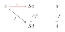
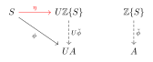
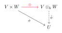
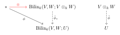
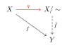
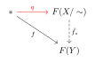
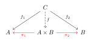
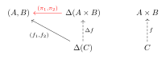
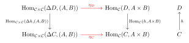

# Universal Property (Category Theory)

Notes in my attempt to consolidate two definitions of 'universal property'.

## Mac Lane Definition

**Definition.** [Maclane[^1], page 57]
Let $\mathcal{C}$ and $\mathcal{D}$ be categories. For a functor $S: \mathcal{D} \to \mathcal{C}$ and an object $c \in \mathcal{C}$, a *universal morphism* from $c$ to $S$ is a pair $(a,u)$, where $a \in \mathcal{D}$ and $u: c \to Sa$ in $\mathcal{C}$, such that for any pair $(d \in \mathcal{D}, f:c \to Sd)$ there exists a **unique** morphism $\tilde{f}: a \to d$ in $\mathcal{D}$ such that $Sf' \circ u = f$. In other words, every morphism $f: c \to Sd$ factors uniquely through the universal morphism $u$. In, again, other words, the following diagram commutes.

The dual is the same with the arrows and composition reversed.

## Alternate (Riehl) Definition

**Definition.** [Reihl[^2], Definition 2.3.3 (page 62)]
Let $\mathcal{C}$ be a category. A *universal property* of an object $c \in \mathcal{C}$ is expressed by a representable functor $F: \mathcal{C} \to \cat{Set}$ and an element $x \in Fc$ that defines a natural isomorphism $\mathcal{C}(c,-) \cong F$ by the Yoneda Lemma. The dual has the natural isomorphism $\mathcal{C}(-,c) \cong F$.

We call $c$ the *universal object*, $x$ the *universal element* and say that $(x,c)$ has the *universal property* expressed by $F$. [^3]

> **Note.** This is directly transcribed from the book, and the names do not line up. The correspondence appears in "Terminology and notation" below.

## Thoughts
### Universal Morphism to Representation
These two definitions are equivalent by [Maclane[^1], page 59 (Proposition 1)]. Roughly it says
- for a functor $S: \mathcal{D} \to \mathcal{C}$ and object $c \in C$, $(a \in \mathcal{D}, u: c \to Sa)$ is a universal morphism from $c$ to $S$ **if and only if** the collection of functions
    $$
    \tau_d: (f': a \to d) \mapsto (Sf' \circ u: c \to Sd)
    $$
    gives a natural isomorphism
    $$
    \mathcal{D}(a,-) \cong \mathcal{C}(c,S-).
    $$
- (Conversely) for $a \in \mathcal{D}$ and $c \in \mathcal{C}$, any natural isomorphism $\mathcal{D}(a,-) \cong \mathcal{C}(c,S-)$ uniquely determines $u: c \to Sa$ such that $(a,u)$ is universal from $c$ to $S$.

**Note.** The second half just says that the translation between the two definitions works in the other way. The reverse construction is not as intuitive (see the proof of [Maclane[^1], page 59 (Proposition 1)]). We just look at the first part.

The proposition says that saying $(a,u)$ is universal morphism is equivalent to saying that the functor $\mathcal{C}(c,S-): \mathcal{D} \to \cat{Set}$ is representable with representing object $a \in \mathcal{D}$. The natural isomorphism $\mathcal{D}(a,-) \cong \mathcal{C}(c,S-)$ is exactly the information:
- an element $u \in \mathcal{C}(c,S\red{a})$, corresponding to the natural isomorphism (via Yoneda lemma), and
- for any $d \in \mathcal{D}$ and morphism $f:c \to Sd$ in $\mathcal{C}(c,Sd)$
- there is a *unique* morphism $f':a \to d$ in $\mathcal{D}(a,d)$ such that $f = Sf' \circ u$.
  - the commuting property is a consequence of naturality (see Product example)

We can interpret any representable functor in a similar way, regardless of if they are of the form $\mathcal{C}(c,S-)$.

### Representation to Universal Morphism

Mac Lane also provides a way to translate from a universal property on a functor $F: \mathcal{D} \to \cat{Set}$ (given by a representing object $a$ and what he calls a universal element $u$ in $F(a)$) to a universal morphism to $F$ (see [Maclane[^1], page 57-58]). This can be used to construct a universal morphism from a universal property from Riehl's definition & Yoneda's Lemma.

It works as follows. Let $*$ be the set with one point, and let $\cat{Ens}$ be an appropriate [full small subcategory of the metacategory of sets](https://math.stackexchange.com/a/495763). Given a representing object $a$ and universal element $u \in F(a)$, consider $u$ as a morphism $* \to F(a)$ in $\cat{Ens}$. Then $(a,u)$ is exactly the universal morphism from $*$ to $F$. Note that doing this *changes* the universal morphism/object/element, because the functor is different so is represented differently.

## Terminology and notation (and translation)
Mac Lane's definition, let $S: \mathcal{D} \to \mathcal{C}$, $c \in \mathcal{C}$, $a \in \mathcal{D}$, $u: c \to Sa$ in $\mathcal{C}$.

- **universal morphism** is $(a,u)$
  - Corresponding representation is $\mathcal{D}(a,-) \cong \mathcal{C}(c,S-)$
  - $(a,u)$ has the **universal property** given by the commutative diagram
- **universal object** is $a$
  - This is the representing object for $\mathcal{C}(c,S-)$
- **universal element** is $u \in \mathcal{C}(c, Sa)$
  - The element in Yoneda Lemma $\Hom(\mathcal{D}(a,-), \mathcal{C}(c,S-)) \cong \mathcal{C}(c,S-)(a) = \mathcal{C}(c, Sa)$.

Riehl's definition, let $F: \mathcal{D} \to \cat{Set}$ be represented by $a \in \mathcal{D}$ with corresponding element $u \in F(a)$ from Yoneda Lemma.
- $(a,u)$ has the **universal property** that it represents the functor $F$
- **universal object** is the representing object $a$
- **universal element** is the element from the Yoneda Lemma $u$ (corresponding to the natural isomorphism $\mathcal{D}(a,-) \cong F$)

Similarly named things here are *the same*, by [Maclane[^1], page 59 (Proposition 1)].

**Note.** The dual universal property has the hom-functors reversed, eg. the Yoneda lemma statement will have $\Hom(\mathcal{D}(-,a), \mathcal{C}(S-,c)) \cong \mathcal{C}(Sa,c)$.

## Example: Free abelian group
The free abelian group construction (from StackExchange[^3]).

Let $S$ be a set and $U: \cat{Ab} \to \cat{Set}$ be the forgetful functor from the category of abelian groups. Write $\Z\{S\}$ for the free abelian group on the set $S$, that is formal $\Z$-linear combinations of elements in $S$, and write $[s] \in \Z\{S\}$ for the basis element corresponding to $s \in S$.

The universal property of $\Z\{S\}$ (more technically of $(\Z\{S\}, \eta: S \to U\Z\{S\})$) is that for any abelian group $A \in \cat{Ab}$ and map $\phi: S \to UA$, there is a unique morphism $\tilde{\phi}: \Z\{S\} \to S$ such that the following diagram commutes.

In Riehl's definition, we have the functor $\cat{Set}(S, U-)$ represented by $\Z\{S\}$, i.e.
$$
\cat{Ab}(\Z\{S\}, -) \cong \cat{Set}(S, U-).
$$
This natural isomorphism is given by the morphism (via Yoneda Lemma) $\eta: S \to U\Z\{S\}$ in $\cat{Set}(S, U\Z\{S\})$, such that
$$
\tau_A: (\tilde\phi: \Z\{S\} \to A) \mapsto (U\tilde{\phi} \circ \eta): S \to UA, s \mapsto U\tilde{\phi}([s])).
$$

The *universal object* (representing) is $\Z\{S\} \in \cat{Ab}$ and the *universal element* (Yoneda) is $\eta \in \cat{Set}(S,U\Z\{S\})$.

Note that this universal property arises from the forgetful-free adjunction where the universal element $\eta$ is the unit of adjunction. For the general case see [Wikipedia](https://en.wikipedia.org/wiki/Universal_property#Relation_to_adjoint_functors).

## Example: Tensor Product (Vector spaces)

The tensor products for vector space construction (from StackExchange[^3], [Maclane[^1], page 58], [Reihl[^2], Example 2.3.7 (page 63)]).

This universal property is clearer in terms of Riehl's definition, and we deduce something similar to the original from the isomorphism. Let $k$ be a field, $V,W$ vectors spaces, and consider the functor $\op{Bilin}_k(V,W;-): \cat{Vect}_k \to \cat{Set}$ which takes vector spaces $U$ to the set of all bilinear maps $V \times W \to U$. This is represented by the tensor product $V \otimes_k W$ such that
$$
\cat{Vect}_k (V \otimes_k W, -) \cong \op{Bilin}_k (V,W; -)
$$
by the natural isomorphism
$$
\tau_U: (\tilde{\phi}: V \otimes_k W \to U) \mapsto (\phi = \tilde{\phi} \circ \otimes: V \times W \to V \otimes_k W \to U).
$$

Here, the universal object (representing) is $V \otimes_k W \in \cat{Vect}_k$ and the universal element (Yoneda) is $\otimes: V \times W \to V \otimes_k W$ in $\op{Bilin}_k(V,W;V \otimes_k W)$.

Recall (from [Thoughts](#Universal-Morphism-to-Representation)) that this bijection is exactly the data: for any vector space $U \in \cat{Vect}_k$ and bilinear map $\phi: V \times W \to U$ in $\op{Bilin}_k(V,W;U)$, there is a unique morphism $\tilde{\phi}: V \otimes_k W \to U$ in $\cat{Vect}_k(V \otimes_k W,U)$ such that $\phi = \tilde{\phi} \circ \otimes$. We can put this information in a commutative diagram.

**Note.** As in this example we can deduce a universal property statement involving 'uniqueness' from the represented functor without going through the universal morphism definition.

**Remark.** If we wanted to view this in terms of universal arrows, we can use the construction [from Mac Lane](#Representation-to-Universal-Morphism). This produces the universal object $*$ and the universal element $\otimes: * \to \op{Bilin}_k(V,W;V \otimes_k W)$ (that picks out $\otimes \in \op{Bilin}_k(V,W;V \otimes_k W)$), which gives the universal morphism $(*,u)$ from $*$ to $\op{Bilin}_k(V,W;-)$. By definition it says that for any vector space $U$ and morphism of sets $\phi: * \to \op{Bilin}_k(V,W;-)$, there is a unique morphism $\tilde{\phi}: V \otimes_k W \to U$ in $\cat{Vect}_k(V \otimes W, U)$ such that $\phi = \tilde{\phi}_* (\otimes)$ where $\tilde{\phi}_*$ is post-composition by $\tilde{\phi}$. In other words, the following diagram commutes.

## Example: Quotients

Quotients in algebra arise from considering equivalence classes of an equivalence relation. Let $\mathcal{C}$ be a category, $X \in \mathcal{C}$ an object, and $\sim$ an equivalence relation on elements in $X$. Then the universal property of the quotient $X/\sim$ (the set of equivalence classes of $\sim$) is that for any $Y \in \mathcal{C}$ and morphism $f: X \to Y$ that respects the equivalence relation $\sim$, there is a unique morphism $\tilde{f}$ such that $f = \tilde{f} \circ q$. Where $q: X \to X/\sim$ is the canonical quotient map.

**In terms of Maclane's definition**: Fix $\mathcal{C}$,$X$ and $\sim$ as above. Define a functor $F: \mathcal{C} \to \cat{Set}$ that maps objects to the set of morphisms from $X$ that preserve the equivalence $Y \mapsto \{f \in \mathcal{C}(X,Y) : a \sim b \implies f(a) = f(b)\}$. On morphisms we map $(Y \xto{g} Z) \mapsto (FY \xto{g_*} FZ)$ where $g_*$ is the postcomposition map with $g$, i.e. $g_*(f) = g \circ f$. This clearly preserves identity morphism, as postcomposition with identity is the identity map on morphisms. This also preserves composition because $(h \circ g)_*(f) = (h \circ g) \circ f = h \circ (g \circ f) = h_* \circ g_* (f)$ by associativity of composition. Thus $F$ is a functor. The construction [from Mac Lane](#Representation-to-Universal-Morphism) implies that the universal property is can be equivalently stated in terms of the following commutative diagram, where $*$ (the one element set) is the universal object and $q: X \to X/\sim$ is the universal element.

**In terms of Reihl's definition**: Taking the same functor as above, we have a natural isomorphism
$$
\mathcal{C}(X/\sim, -) \cong F.
$$
Here the universal object is $X/\sim$ and the universal element is the canonical projection $q: X \to X/\sim$ in $F(X/\sim)$ (Yoneda). This has the same information as the first diagram above: given any object $Y$ and morphism $f: X \to Y$ in $F(Y)$ that respects the equivalence relation, there exists a unique morphism $\tilde{f} \in \mathcal{C}(X/\sim, Y)$ such that $f = \tilde{f} \circ q$. That is, all such morphisms $f$ *factor through* the quotient $X/\sim$.

## Example: Products

Let $\mathcal{C}$ be a category and elements $A,B \in \mathcal{C}$. The product of $A$ and $B$, we write as $A \times B$, is the element in $\mathcal{C}$ (along with projection maps $\pi_1: A \times B \to A, \pi_2: A \times B \to B$) with the following universal property. For any $C \in \mathcal{C}$ and maps $f_1:C \to A, f_2:C \to B$, there is a unique morphism $f:C \to A \times B$ such that $f_1 = \pi_1 \circ f$ and $f_2 = \pi_2 \circ f$. This is typically depicted by the following commutative diagram.

To write this like the triangle diagrams we have above, we define the **diagonal functor** $\Delta : \mathcal{C} \to \mathcal{C} \times \mathcal{C}, A \mapsto (A,A)$, from $\mathcal{C}$ to the product category $\mathcal{C} \times \mathcal{C}$ (excuse the apparent recursion). We can use this to "fold" the sides of the above diagram to the following equivalent commuting diagram.

This depicts a universal morphism from $\Delta$ to $(A,B)$ given by the product object $A \times B \in \mathcal{C}$ with the projection maps $(\pi_1,\pi_2)$. This is in the form of MacLane's definition.

**In terms of Reihl's definition**: Note that this is the dual universal property as morphisms are reversed as in the definition, and thus we need to dualise the "translation" we gave above. The representable functor we have is $\Hom_{\mathcal{C} \times \mathcal{C}}(\Delta -, (A,B)): \mathcal{C}^{op} \to \cat{Set}$ (using $\Hom$ to make it easier to read), represented by $A \times B$. The universal element is $(\pi_1,\pi_2) \in \Hom_{\mathcal{C} \times \mathcal{C}}(\Delta (A \times B), (A,B))$. By Yoneda lemma (and (Reihl) definition of universal property), this universal element $(\pi_1,\pi_2)$ corresponds to the natural isomorphism
$$
\Hom_\mathcal{C}(-,A \times B) \cong \Hom_{\mathcal{C} \times \mathcal{C}}(\Delta -, (A,B))
$$
which is natural in $C$ (of the above diagram). To reiterate the connection between the definitions, this natural isomorphism (depending on the universal element $(\pi_1,\pi_2)$) is a one-to-one correspondence between morphisms $(f_1,f_2): \Delta C \to (A,B)$ and $f: C \to A \times B$ (which gives rise to $\Delta f: \Delta C \to \Delta(A \times B)$  in the diagram). In other words, given any $C \in \mathcal{C}$ and $(f_1,f_2) \in \mathcal{C} \times \mathcal{C}$, there exists $f: C \to A \times B$ in $\mathcal{C}$ such that the construction is natural in $C$ (the naturality gives rise to the commuting diagram).

By the proof of the Yoneda lemma, the natural isomorphism associated with $(\pi_1,\pi_2)$ is
$$
\alpha_C: \Hom_\mathcal{C}(C,A \times B) \xto{\sim} \Hom_{\mathcal{C} \times \mathcal{C}}(\Delta C, (A,B))
$$
which takes $f: C \to A \times B$ to $\Hom_{\mathcal{C} \times \mathcal{C}}(\Delta f, (A,B)) (\pi_1,\pi_2) = (\pi_1 \circ f, \pi_2 \circ f) : \Delta C \to (A,B)$. We write the inverse as mapping $(f_1,f_2) \mapsto \angl{f_1,f_2}$ [^4], which, in $\cat{Set}$, is the function $\angl{f_1,f_2}: C \to A \times B, c \mapsto (f_1(c),f_2(c))$.

**Naturality.** We use this chance to also explore the "natural" part of this natural isomorphism arising from the Yoneda lemma. Let
$$
\red{\eta}: \Hom_{\mathcal{C} \times \mathcal{C}}(\Delta -, (A,B)) \xto{\sim} \Hom_\mathcal{C}(-,A \times B)
$$
be the above natural isomorphism. Then naturality implies that the following diagram commutes (isomorphism implies that the inverse natural transformation gives a similar commuting diagram).

Note that this is a natural transformation between two contrapositive functors, so the vertical arrows are reversed. The left arrow takes a morphism $\Delta D = (D,D) \to (A,B)$ and precomposes with $\Delta h = (h,h): (C,C) \to (D,D)$, and the right arrow takes a morphism $D \to A \times B$ and precomposes with $h: C \to D$.

Chasing the diagram gives some intuition into what is happening. Take some arbitrary $(f_1,f_2) \in \Hom_{\mathcal{C}\times\mathcal{C}}(\Delta D, (A,B))$, the top arrow gives $\angl{f_1,f_2}: D \to A \times B$ and the right arrow gives a map $\angl{f_1,f_2} \circ h$. Along the other branch, the left arrow produces $(f_1 \circ h, f_2 \circ h)$ and the bottom gives $\angl{f_1 \circ h, f_2 \circ h}$. Commutativity is just the equality $\angl{f_1,f_2} \circ h = \angl{f_1 \circ h, f_2 \circ h}$, which should be clear on the level of sets.

Taking $C$ arbitrary, $D = A \times B$, $h = \eta_C(f_1,f_2): C \to A \times B$ we can recover the commuting property. Let's chase $(\pi_1,\pi_2) \in \Hom_{\mathcal{C}\times\mathcal{C}}(\Delta (A \times B), (A,B))$ through the diagram. The top branch sends this to the identity $A\times B \to A \times B$ (of course the universal morphism factors through itself via the identity), then the right branch precomposes this with $h$, resulting in $h = \eta_C(f_1,f_2)$. Since $\eta$ is a natural *isomorphism*, we can invert along the bottom arrow to give $(f_1,f_2)$ in the bottom left set. Now the left branch precomposes $(\pi_1,\pi_2)$ with $\Delta h$, which results in $(\pi_1 \circ h, \pi_2 \circ h)$. Since the diagram commutes, we have that $(f_1,f_2) = (\pi_1 \circ h, \pi_2 \circ h)$ which is the commutativity of the original diagram.

## Uniqueness
It can be shown that if a functor $F$ can be represented by two different universal objects $a, a'$, then $a$ and $a'$ are isomorphic (see [Reihl[^2], Proposition 2.3.1 (page 62)] or StackExchange[^3])

[^1]: Mac Lane, *Categories for the working mathematician*.
[^2]: Reihl, *Category Theory in Context*.
[^3]: Math StackExchange, Understanding Universal Property and Universal Element (from Category Theory in Context, Riehl), https://math.stackexchange.com/questions/3688510/understanding-universal-property-and-universal-element-from-category-theory-in
[^4]: Notation from [Wikipedia](https://en.wikipedia.org/wiki/Product_(category_theory)#Product_of_two_objects)

