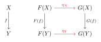
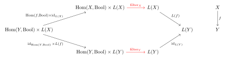
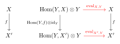
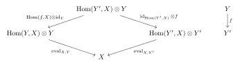

# Haskell (and Types) to Category theory

Some type structures in Haskell, and type theory in general, are inspired by algebraic objects in category theory. For example, there are correspondences between
- `Functor` in Haskell and categorical functors;
- `Applicative` functors in Haskell and lax monoidal/closed functors (with some more properties) in category theory;
- `Monad` in Haskell and monads in category theory.

## Functors and Functors
In Haskell, `Functor` is a typeclass defined by
```hs
class Functor f where
  fmap :: (a -> b) -> f a -> f b
```
with two properties:
- (Identity) `fmap id = id`,
- (Composition) `fmal (f . g) == fmap f . fmap g`.
Note that sometimes we also see `(<$) :: a -> f b -> f a` or `($>)`, but these are just variations of `fmap`. Examples are omitted as they can be found abundantly online.

In mathematics, a functor between categories $\mathcal{C}$ and $\mathcal{D}$ is a mapping that
- associates an object $X \in \op{ob} \mathcal{C}$ to an object $FX = F(X) \in \op{ob} \mathcal{D}$,
- and associates a morphism $f:X \to Y \in \Hom_\mathcal{C}(X,Y)$ to a morphism $Ff = F(f) \in \Hom_\mathcal{D}(FX, FY)$ subject to the following conditions
  - (Identity) for any $X \in \mathcal{C}$, we have $F(\op{id}_X) = \op{id}_{F(X)}$;
  - (Composition) for any morphism $f:X \to Y$, $g: Y \to Z$ in $\mathcal{C}$, we have $F(g \circ f) = F(g) \circ F(f)$;


### Correspondence
The `f` in Haskell is exactly the categorical functor on objects, while `fmap` is  the categorical functor on morphisms. This had to be split into two different things because of the overloading of the functor in mathematics. The functor laws between the two are basically identical, taking the type inference in the Haskell version in to account.


## Parametrised polymorphic functions and Natural transformations

In Haskell, a (parametrised) polymorphic function is a function parametrised over some of it's types, for example:
```hs
id :: forall a. a -> a
append :: forall a. [a] -> [a] -> a
```
Parametricity is a property of polymorphic functions: for (some) polymorphic functions `f` parametrised on type `a`, and for any function `g :: a -> b`, we have `f . (fmap g) = (fmap g) . f`. (As always, the omitted types due to Haskell's type inference is making things hard to understand, more clarity can be found in the mathematics below.) In his well-known paper *Theorems for Free* [^1] (based by a paper by Reynolds), Wadler explains that all (parametrised) polymorphic functions have this parametricity property and gives a strategy to find the "theorem" for any polymorphic function.
- The parametric polymorphism condition on functions restricts them to being (some sort of) natural transformation, even though it is not the case that all indexed families of morphisms are natural transformations.
- An outline of "every parametrised polymorphic function is a natural transformation" can be found at [this stackexchange post](https://cs.stackexchange.com/questions/136359/rigorous-proof-that-parametric-polymorphism-implies-naturality-using-parametrici), citing Reynold's paper.
- Note, we are not being fully assertive about the correspondence because some functors have contravariance, leads to a more general idea of dinaturality.

In mathematics, a natural transformation is a mapping between functors. For functors $F,G : \mathcal{C} \to \mathcal{D}$, a natural transformation $\eta: F \to G$ is a collection of morphisms $\{\eta_X : F(X) \to G(X) \}_{X \in \mathcal{C}}$ in $\mathcal{D}$ such that the following diagram commutes for every morphism $f: X \to Y \in \mathcal{C}$.

The commutativity of the diagram is the same as saying $\eta_Y \circ F(f) = G(f) \circ \eta_X$.
- More genersally, a dinatural transformation adds one edge to each of the two branches to account for contravariance in the domain and the codomain, leading to a hexagonal shape rather than a square. The contravariant parts reverse the direction of the function $f$. For a concrete example, see `filter` below.

### Correspondence
It is pretty clear that parametrised polymorphic functions have some correspondence to natural transformations, and parametricity corresponds to the commutativity of the diagram. To give more clarity to the Haskell version, we describe it more explicitly. Let `F,G :: * -> *` be (covariant) functors and `η :: forall t. F t -> G t` be a polymorphic function. Then parametricity we stated above says that for any function `f :: a -> b`,
```hs
η . fmap f = fmap f . η
```
To break down the types, the left has `η :: F b -> G b` (where `b` is the codomain of `f`) and `fmap f :: F a -> F b`. The right has `η :: F a -> G a` (where `a` is the domain of `f`) and `fmap f :: G a -> G b`. These are deduced in Haskell with type inference.

### Examples
Here are some standard examples (see [Wadler[^1], Figure 1]).

**Notation.** For a polymorphic function $\eta : \forall A. F(A) \to G(A)$ we write $\eta_X : F(X) \to G(X)$ (as above) for the polymorphic function applied to a specific type $X$.

`head :: forall a. [a] -> a`
- This is a natural transformation from the list functor $L$ to the identity functor $\op{Id}$.
- Given a function $f: X \to Y$, the parametricity property follows: $\op{head}_Y \circ L(f) = \op{Id}(f) \circ \op{head}_X$
  - simplified: $\op{head}_Y \circ L(f) = f \circ \op{head}_X$
  - in haskell: `head . fmap f = f . head`

`(++) :: forall a. [a] -> [a] -> [a]`
- This is a natural transformation from the product of list functors $L \times L: * \times * \to *$ (defined as you would expect on products) to the list functor $L$.
  - Note that we "uncurry" this (ie. apply tensor-hom adjuction) so that this fits into the above definitions of natural transformation. Hence why we use the product $L \times L$.
- Given a function $f: X \to Y$, the parametricity property follows: $(++)_Y \circ (L \times L)(f) = L(f) \circ (++)_X$
  - simplified: $(++)_Y \circ (L(f) \times L(f)) = L(f) \circ (++)_X$
  - in haskell: `(++) (fmap f xs) (fmap f ys) = fmap f ((++) xs ys)`
    - or with infix: `(fmap f xs) ++ (fmap f ys) = fmap f (xs ++ ys)`

`filter :: forall a. (a -> Bool) -> [a] -> [a]` (hard)
- This example is in fact not natural, not even extranatural, but a *dinatural* transformation (a generalisation of natural transformation)
  - We include this anyway, to show how to obtain Wadler's "theorem" for `filter`
- This is a dinatural transformation from $\Hom(-,\op{Bool}) \times L: *^{op} \times * \to *$ to the list functor $L: *^{op} \times * \to *$ (deformed in such a way to ignore it's contravariant argument).
  - Here, we uncurried so we can have two functors.
  - Recall the (contravariant) $\Hom(-,\op{Bool})$ functor is defined such that on types $X$,
    $$
    \Hom(-,\op{Bool})^{\op{ob}} : X \mapsto \Hom(X,\op{Bool}),
    $$
    and on morphisms $f: X \to Y$ by
    $$
    \Hom(-,\op{Bool})^{\op{mor}} : f \mapsto (\Hom(f,\op{Bool}): \Hom(Y,\op{Bool}) \to \Hom(X,\op{Bool}))
    $$
    where $\Hom(f,\op{Bool}): (g : Y \to \op{Bool}) \mapsto (g \circ f : X \to \op{Bool})$
    - (I don't know how to write contravariant functors in haskell; for some solace, the covariant version of this functor $\Hom(A,-)$ is `(->) A` in Haskell)
- Given a function $f: X \to Y$, the parametricity property follows by dinaturality:
  $$
  L(f) \circ \op{filter}_X \circ (\Hom(-,\op{Bool}) \times L)(f^{op}, \op{id}_X) = \op{id}_{L(Y)} \circ \op{filter}_Y \circ (\Hom(-,\op{Bool}) \times L)(\op{id}_Y^{op}, f)
  $$
  - simplified: $L(f) \circ \op{filter}_X \circ (\Hom(f,\op{Bool}) \times \op{id}_{L(X)}) = \op{filter}_Y \circ (\op{id}_{\Hom(Y,\op{Bool})} \times L(f))$
  - Dinaturality is summed up by the commuting of the following diagram:
    
  - in haskell, applied to one argument $g:Y \to \op{Bool}$: `fmap f . filter (g . f) = filter g . fmap f`
    - with the second argument `xs :: [Y]` we get `fmap f (filter (g . f) xs) = filter g (fmap f xs)`

Some more general examples can be found at [Bartosz Milewski's Programming Cafe](https://bartoszmilewski.com/2014/09/22/parametricity-money-for-nothing-and-theorems-for-free/).

### A comment on parametric functions on multiple variables
The analogous concept is collections of morphisms with multiple indexing variables, where we can be eg. natural in one variable and extranatural in another. This leads to multiple properties that they satisfy. An easy example is the evaluation map $\op{eval}_{X,Y} : \Hom(Y,X) \times Y \to X$ (the counit of the tensor-hom adjunction), which is natural in $X$ with commutative diagram

and extranatural in $Y$ (because fixing $X$ in $\Hom(Y,X)$ makes that component contravariant) with:

In Haskell we can write `eval :: forall a. forall b. (a -> b) -> a -> b` for the evaluation function. Then naturality, or "parametricity", will give two properties:
- ("for $X$") for all `f :: a -> a'`, we have `f . (eval g) = eval (f . g)`,
- ("for $Y$") for all `f :: b -> b'`, we have `eval (g . f) x = eval g (f x)`,
which are both pretty obvious properties you would expect from an evaluation function. This idea can probably be extended to functions parametrised over multiple types.


## Applicative Functors and Lax Closed Functors

Coming soon.


## Monads and Monads

Coming soon.


[^1]: Wadler, Philip, [*Theorems for free!*](https://people.mpi-sws.org/~dreyer/tor/papers/wadler.pdf). 4th Int'l Conf. on Functional Programming and Computer Architecture. London.


