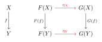

# Haskell (and Types) to Category theory

Some type structures in Haskell, and type theory in general, are inspired by algebraic objects in category theory. For example, there are correspondences between
- `Functor` in Haskell and categorical functors;
- `Applicative` functors in Haskell and lax monoidal/closed functors (with some more properties) in category theory;
- `Monad` in Haskell and monads in category theory.

## Functors and Functors
In Haskell, `Functor` is a typeclass defined by
```hs
class Functor f where
  fmap :: (a -> b) -> f a -> f b
```
with two properties:
- (Identity) `fmap id = id`,
- (Composition) `fmal (f . g) == fmap f . fmap g`.
Note that sometimes we also see `(<$) :: a -> f b -> f a` or `($>)`, but these are just variations of `fmap`. Examples are omitted as they can be found abundantly online.

In mathematics, a functor between categories $\mathcal{C}$ and $\mathcal{D}$ is a mapping that
- associates an object $X \in \op{ob} \mathcal{C}$ to an object $FX = F(X) \in \op{ob} \mathcal{D}$,
- and associates a morphism $f:X \to Y \in \Hom_\mathcal{C}(X,Y)$ to a morphism $Ff = F(f) \in \Hom_\mathcal{D}(FX, FY)$ subject to the following conditions
  - (Identity) for any $X \in \mathcal{C}$, we have $F(\op{id}_X) = \op{id}_{F(X)}$;
  - (Composition) for any morphism $f:X \to Y$, $g: Y \to Z$ in $\mathcal{C}$, we have $F(g \circ f) = F(g) \circ F(f)$;


### Correspondence
The `f` in Haskell is exactly the categorical functor on objects, while `fmap` is  the categorical functor on morphisms. This had to be split into two different things because of the overloading of the functor in mathematics. The functor laws between the two are basically identical, taking the type inference in the Haskell version in to account.


## Parametrised polymorphic functions and Natural transformations

In Haskell, a (parametrised) polymorphic function is a function parametrised over some of it's types, for example:
```hs
id :: forall a. a -> a
append :: forall a. [a] -> [a] -> a
```
Parametricity is a property of polymorphic functions: for any polymorphic function `f` parametrised on type `a`, and for any function `g :: a -> b`, we have `f . (fmap g) = (fmap g) . f`. (As always, the omitted types due to Haskell's type inference is making things hard to understand, more clarity can be found in the mathematics below.) In the famous paper *Theorems for Free* [^1] (based by a paper by Reynolds), Wadler explains that all (parametrised) polymorphic functions have this parametricity property and gives a strategy to find the "theorem" for any polymorphic function.
- The parametric polymorphism condition on functions restricts them to being natural transformations, though it is not the case that all indexed families of morphisms are natural transformations.
- An outline of "every parametrised polymorphic function is a natural transformation" can be found at [this stackexchange post](https://cs.stackexchange.com/questions/136359/rigorous-proof-that-parametric-polymorphism-implies-naturality-using-parametrici), citing Reynold's paper.

In mathematics, a natural transformation is a mapping between functors. For functors $F,G : \mathcal{C} \to \mathcal{D}$, a natural transformation $\eta: F \to G$ is a collection of morphisms $\{\eta_a \}_{a \in \mathcal{C}}$ such that the following diagram commutes for every morphism $f: X \to Y \in \mathcal{C}$.

The commutativity of the diagram is the same as saying $\eta_Y \circ F(f) = G(f) \circ \eta_X$.

### Correspondence
It is pretty clear that parametrised polymorphic functions correspond to natural transformations, and parametricity corresponds to the commutativity of the diagram. To give more clarity to the Haskell version, we describe it more explicitly. Let `F,G :: * -> *` be functors and `η :: forall t. F t -> G t` be a polymorphic function. Then parametricity says that for any function `f :: a -> b`,
```hs
η . fmap f = fmap f . η
```
To break down the types, the left has `η :: F b -> G b` (where `b` is the codomain of `f`) and `fmap f :: F a -> F b`. The right has `η :: F a -> G a` (where `a` is the domain of `f`) and `fmap f :: G a -> G b`. These are deduced in Haskell with type inference.


## Applicative Functors and Lax Closed Functors

Coming soon.


## Monads and Monads

Coming soon.


[^1]: Wadler, Philip, *Theorems for free!*. 4th Int'l Conf. on Functional Programming and Computer Architecture. London.


