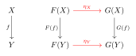
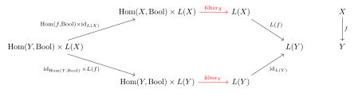
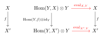
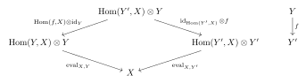
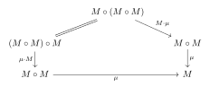
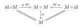
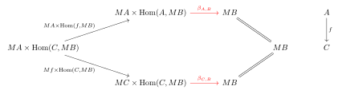
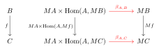

# Haskell (and Types) to Category theory

Some type structures in Haskell, and type theory in general, are inspired by algebraic objects in category theory. For example, there are correspondences between
- `Functor` in Haskell and categorical functors;
- `Applicative` functors in Haskell and lax monoidal/closed functors (with some more properties) in category theory;
- `Monad` in Haskell and monads in category theory.

## Functors and Functors
In Haskell, `Functor` is a typeclass defined by
```hs
class Functor f where
  fmap :: (a -> b) -> f a -> f b
```
with two properties:
- (Identity) `fmap id = id`,
- (Composition) `fmal (f . g) == fmap f . fmap g`.
Note that sometimes we also see `(<$) :: a -> f b -> f a` or `($>)`, but these are just variations of `fmap`. Examples are omitted as they can be found abundantly online.

In mathematics, a functor between categories $\mathcal{C}$ and $\mathcal{D}$ is a mapping that
- associates an object $X \in \op{ob} \mathcal{C}$ to an object $FX = F(X) \in \op{ob} \mathcal{D}$,
- and associates a morphism $f:X \to Y \in \Hom_\mathcal{C}(X,Y)$ to a morphism $Ff = F(f) \in \Hom_\mathcal{D}(FX, FY)$ subject to the following conditions
  - (Identity) for any $X \in \mathcal{C}$, we have $F(\op{id}_X) = \op{id}_{F(X)}$;
  - (Composition) for any morphism $f:X \to Y$, $g: Y \to Z$ in $\mathcal{C}$, we have $F(g \circ f) = F(g) \circ F(f)$;


### Correspondence
With the above notation, `f` in Haskell is exactly the categorical functor on objects, while `fmap` is  the categorical functor on morphisms. This had to be split into two different things because of the overloading of the functor in mathematics. The functor laws between the two are basically identical, taking the type inference in the Haskell version in to account.


## Parametrised polymorphic functions and Natural transformations

In Haskell, a (parametrised) polymorphic function is a function parametrised over some of it's types, for example:
```hs
id :: forall a. a -> a
append :: forall a. [a] -> [a] -> a
```
Parametricity is a property of polymorphic functions: for (some) polymorphic functions `f` parametrised on type `a`, and for any function `g :: a -> b`, we have `f . (fmap g) = (fmap g) . f`. (As always, the omitted types due to Haskell's type inference is making things hard to understand, more clarity can be found in the mathematics below.) In his well-known paper *Theorems for Free* [^1] (based by a paper by Reynolds), Wadler explains that all (parametrised) polymorphic functions have this parametricity property and gives a strategy to find the "theorem" for any polymorphic function.
- The parametric polymorphism condition on functions restricts them to being (some sort of) natural transformation, even though it is not the case that all indexed families of morphisms are natural transformations.
- An outline of "every parametrised polymorphic function is a natural transformation" can be found at [this stackexchange post](https://cs.stackexchange.com/questions/136359/rigorous-proof-that-parametric-polymorphism-implies-naturality-using-parametrici), citing Reynold's paper.
- Note, we are not being fully assertive about the correspondence because some functors have contravariance, leads to a more general idea of dinaturality.

In mathematics, a natural transformation is a mapping between functors. For functors $F,G : \mathcal{C} \to \mathcal{D}$, a natural transformation $\eta: F \to G$ is a collection of morphisms $\{\eta_X : F(X) \to G(X) \}_{X \in \mathcal{C}}$ in $\mathcal{D}$ such that the following diagram commutes for every morphism $f: X \to Y \in \mathcal{C}$.

The commutativity of the diagram is the same as saying $\eta_Y \circ F(f) = G(f) \circ \eta_X$.
- More genersally, a dinatural transformation adds one edge to each of the two branches to account for contravariance in the domain and the codomain, leading to a hexagonal shape rather than a square. The contravariant parts reverse the direction of the function $f$. For a concrete example, see `filter` below.

### Correspondence
It is pretty clear that parametrised polymorphic functions have some correspondence to natural transformations, and parametricity corresponds to the commutativity of the diagram. To give more clarity to the Haskell version, we describe it more explicitly. Let `F,G :: * -> *` be (covariant) functors and `η :: forall t. F t -> G t` be a polymorphic function. Then parametricity we stated above says that for any function `f :: a -> b`,
```hs
η . fmap f = fmap f . η
```
To break down the types, the left has `η :: F b -> G b` (where `b` is the codomain of `f`) and `fmap f :: F a -> F b`. The right has `η :: F a -> G a` (where `a` is the domain of `f`) and `fmap f :: G a -> G b`. These are deduced in Haskell with type inference.

### Examples
Here are some standard examples (see [Wadler[^1], Figure 1]).

**Notation.** For a polymorphic function $\eta : \forall A. F(A) \to G(A)$ we write $\eta_X : F(X) \to G(X)$ (as above) for the polymorphic function applied to a specific type $X$.

`head :: forall a. [a] -> a`
- This is a natural transformation from the list functor $L$ to the identity functor $\op{Id}$.
- Given a function $f: X \to Y$, the parametricity property follows: $\op{head}_Y \circ L(f) = \op{Id}(f) \circ \op{head}_X$
  - simplified: $\op{head}_Y \circ L(f) = f \circ \op{head}_X$
  - in haskell: `head . fmap f = f . head`

`(++) :: forall a. [a] -> [a] -> [a]`
- This is a natural transformation from the product of list functors $L \times L: * \times * \to *$ (defined as you would expect on products) to the list functor $L$.
  - Note that we "uncurry" this (ie. apply tensor-hom adjuction) so that this fits into the above definitions of natural transformation. Hence why we use the product $L \times L$.
- Given a function $f: X \to Y$, the parametricity property follows: $(++)_Y \circ (L \times L)(f) = L(f) \circ (++)_X$
  - simplified: $(++)_Y \circ (L(f) \times L(f)) = L(f) \circ (++)_X$
  - in haskell: `(++) (fmap f xs) (fmap f ys) = fmap f ((++) xs ys)`
    - or with infix: `(fmap f xs) ++ (fmap f ys) = fmap f (xs ++ ys)`

`filter :: forall a. (a -> Bool) -> [a] -> [a]` (hard)
- This example is in fact not natural, not even extranatural, but a *dinatural* transformation (a generalisation of natural transformation)
  - We include this anyway, to show how to obtain Wadler's "theorem" for `filter`
- This is a dinatural transformation from $\Hom(-,\op{Bool}) \times L: *^{op} \times * \to *$ to the list functor $L: *^{op} \times * \to *$ (deformed in such a way to ignore it's contravariant argument).
  - Here, we uncurried so we can have two functors.
  - Recall the (contravariant) $\Hom(-,\op{Bool})$ functor is defined such that on types $X$,
    $$
    \Hom(-,\op{Bool})^{\op{ob}} : X \mapsto \Hom(X,\op{Bool}),
    $$
    and on morphisms $f: X \to Y$ by
    $$
    \Hom(-,\op{Bool})^{\op{mor}} : f \mapsto (\Hom(f,\op{Bool}): \Hom(Y,\op{Bool}) \to \Hom(X,\op{Bool}))
    $$
    where $\Hom(f,\op{Bool}): (g : Y \to \op{Bool}) \mapsto (g \circ f : X \to \op{Bool})$
    - (I don't know how to write contravariant functors in haskell; for some solace, the covariant version of this functor $\Hom(A,-)$ is `(->) A` in Haskell)
- Given a function $f: X \to Y$, the parametricity property follows by dinaturality:
  $$
  L(f) \circ \op{filter}_X \circ (\Hom(-,\op{Bool}) \times L)(f^{op}, \op{id}_X) = \op{id}_{L(Y)} \circ \op{filter}_Y \circ (\Hom(-,\op{Bool}) \times L)(\op{id}_Y^{op}, f)
  $$
  - simplified: $L(f) \circ \op{filter}_X \circ (\Hom(f,\op{Bool}) \times \op{id}_{L(X)}) = \op{filter}_Y \circ (\op{id}_{\Hom(Y,\op{Bool})} \times L(f))$
  - Dinaturality is summed up by the commuting of the following diagram:
    
  - in haskell, applied to one argument $g:Y \to \op{Bool}$: `fmap f . filter (g . f) = filter g . fmap f`
    - with the second argument `xs :: [Y]` we get `fmap f (filter (g . f) xs) = filter g (fmap f xs)`

Some more general examples can be found at [Bartosz Milewski's Programming Cafe](https://bartoszmilewski.com/2014/09/22/parametricity-money-for-nothing-and-theorems-for-free/).

### A comment on parametric functions on multiple variables
The analogous concept is collections of morphisms with multiple indexing variables, where we can be eg. natural in one variable and extranatural in another. This leads to multiple properties that they satisfy. An easy example is the evaluation map $\op{eval}_{X,Y} : \Hom(Y,X) \times Y \to X$ (the counit of the tensor-hom adjunction), which is natural in $X$ with commutative diagram

and extranatural in $Y$ (because fixing $X$ in $\Hom(Y,X)$ makes that component contravariant) with:

In Haskell we can write `eval :: forall a. forall b. (a -> b) -> a -> b` for the evaluation function. Then naturality, or "parametricity", will give two properties:
- ("for $X$") for all `f :: a -> a'`, we have `f . (eval g) = eval (f . g)`,
- ("for $Y$") for all `f :: b -> b'`, we have `eval (g . f) x = eval g (f x)`,
which are both pretty obvious properties you would expect from an evaluation function. This idea can probably be extended to functions parametrised over multiple types.


## Applicative Functors and Lax Monoidal/Closed Functors


The rest is possibly coming soon.

### Resources

The structure maps for this case (and another view via the Day convolution) are dealt with in [Bartosz Milewski's blog post on Applicative Functors](https://bartoszmilewski.com/2017/02/06/applicative-functors/).


## Monads and Monads

In Haskell, `Monad` is a typeclass defined by
```hs
class Monad m where
  (>>=)  :: m a -> (a -> m b) -> m b -- "bind"  
  return ::   a               -> m a
```
with three properties:
- (left unit) `return a >>= k = k a`,
- (right unit) `m >>= return = m`,
- (associativity) `m >>= (\x -> k x >>= h) = (m >>= k) >>= h`.
Note that in `Prelude`, we see an additional method `(>>) :: m a -> m b -> m b` which is derived from `>>=` by `m >> k = m >>= (\_ -> k)`. This is just included for convenience and is not required to define a `Monad`.

In mathematics, a monad is *a monoid object in the category of endofunctors*. More precisely, for a category $\mathcal{C}$, the endofunctors of the category $\op{End}(\mathcal{C}) = \Hom(\mathcal{C},\mathcal{C})$ form a category where objects are endofunctors, morphisms are natural transformations and composition is vertical composition $\circ_v$ of natural transformations (we may write this as just $\circ$). Furthermore, this is a strict monoidal category with the unit object $\op{id} = \op{id}_\mathcal{C}$, tensor product of objects given by composition of functors and tensor product of morphisms is horizontal composition $\circ_h$ of natural transformations. Hence a monad (with respect to $\mathcal{C}$) is a monoid object $M$ in the monoidal category $\op{End}(\mathcal{C})$. That is, $M \in \op{End}(\mathcal{C})$ equipped with natural transformations
- (unit) $\eta: \op{id} \to M$,
- (multiplication) $\mu: M \circ M \to M$,
such that the following diagrams commute:
- (associativity) 
- (unit) 

where $M\cdot \mu: M \circ (M \circ M) \to M \circ M$ etc. denotes whiskering (horizontal composition with the identity natural transformation $\op{id}_M$, see Appendix A1).
Equationally, these diagrams correspond to the relations
- (associativity) $\mu \circ_v (\mu \cdot M) = \mu \circ_v (M \cdot \mu)$,
- (unit) $\mu \circ_v (\eta \cdot M) = \mu \circ_v (M \cdot \eta) = \op{id}_M$.

### Correspondence
> Note: we take advantage of having elements in the objects in our category, but proofs purely from morphism compositions can also be written down (although difficult).

We first check that the structure maps agree.
- `Monad`'s contain `return :: a -> m a` which corresponds to a singular component of the unit $\eta_A: A \to M A$.
- The bind function `>>=` (which we will write as $\beta$, where $\beta_{A,B} : MA \times Hom(A,MB) \to MB$) appears to be completely different from the multiplication map $\mu$, but can be constructed from one another.
  - (`>>=` to $\mu$)
    - $\mu$ is called `join` in Haskell, and is defined using `>>=` by
      ```hs
      join :: m (m a) -> m a
      join x = x >>= id
      ```
      where `id` is the identity function `id x = x`
    - Mathematically, $\mu_A = \beta_{MA,A}(-,\op{id}_{MA}) : M^2 A \to MA$ (partial application of $\beta$)
  - ($\mu$ to `>>=`)
    - `>>=` is defined using `join` by
      ```hs
      (>>=) :: m a -> (a -> m b) -> m b
      (>>=) x f = join (fmap f x)
      ```
      where Haskell infers `fmap` to be from the monad `m`
    - Mathematically, $\beta_{A,B} = \mu_B \circ ev_{MA,M^2 B} \circ (MA \times M^{mor})$
      $$
      \beta_{A,B} : MA \times \Hom(A,MB) \xto{MA \times M^{mor}} MA \times \Hom(MA,M^2 B) \xto{ev_{MA,M^2 B}} M^2 B \xto{\mu_B} MB
      $$
      where $ev$ is the counit of the tensor-hom adjunction. For the sake of clarity, we may write
      $$
      \beta_{A,B}(m,f) = \mu_B \circ M(f) (m)
      $$
      where $m \in MA$ and $f: A \to MB$.

Since parametrised functions in Haskell have "parametricity" properties, we expect $\beta$ to be a (di)natural transformation. Indeed we have the following.
- $\beta_{A,B}$ is extranatural in $A$:
  - For a morphism $f:A \to C$, we have
    
    which commutes because
    - the top branch maps
      $$
      m \mapsto \beta_{A,B} \circ (MA \times \Hom(f,MB)) (m,g) = \beta_{A,B} (m,g \circ f) = \mu_B \circ M(g \circ f) (m)
      $$
    - and the bottom branch maps
      $$
      m \mapsto \beta_{C,B} \circ (Mf \times \Hom(C,MB)) (m,g) = \beta_{A,B} (M(f)(m),g) = \mu_B \circ M(g) \circ M(f) (m)
      $$
    - which are equal by functoriality of $M$.
  - The corresponding parametricity relation is $\beta_{A,B} (m,g \circ f) = \beta_{C,B} (M(f)(m), g)$
    - in Haskell, `x >>= (g . f) = (fmap f x) >>= g`
- $\beta_{A,B}$ is natural in $B$:
  - For a moprhism $f: B \to C$, we have
    
    which commutes because
    - the top-right branch maps $(m,g) \mapsto M(f) \circ \beta_{A,B}(m,g) = M(f) \circ \mu_B \circ M(g) (m)$
    - and the left-bottom branch maps $(m,g) \mapsto \beta_{A,C} \circ (MA \times \Hom(A,Mf)) (m,g)$
      - $= \beta_{A,C} (m, (Mf) \circ g)$
      - $= \mu_C \circ M((Mf) \circ g)(m)$
      - $= \mu_C \circ M^2(f) \circ M(g)(m)$
        - by functoriality of $M$
      - $= M(f) \circ \mu_B \circ M(g)(m)$
        - by naturality of $\mu$
      - which is equal.
  - The corresponding parametricity relation is $M(f)(\beta_{A,B}(m,g)) = \beta_{A,C}(m, M(f) \circ g)$
    - in Haskell, `fmap f (x >>= g) = x >>= fmap f . g` (note `fmap f . g = (fmap f) . g`)
#### Relations: Cats to Haskell
Now we observe that the `Monad` relations in Haskell are indeed true in the categorical counterpart.

The `Monad` relations can be written mathematically as
- (left unit) $\beta_{A,B}(\eta_A(x), f) = f(x)$
- (right unit) $\beta_{A,A}(m,\eta_A) = m$
- (associativity) $\beta_{A,C}(m,\beta_{B,C}(f(-),g)) = \beta_{B,C}(\beta_{A,B}(m,f),g)$
where $f: A \to MB$, $g: B \to MC$, $x\in A$, $m \in MA$.

##### Left Unit
We have $\beta_{A,B} (\eta_A(x),f) = \mu_B \circ M(f) \circ \eta_A (x)$
- $= \mu \circ \eta_{MB} \circ f (x)$
  - by naturality of $\eta$
- $= f(x)$
  - since $\eta_{MB} = (\eta \cdot M)_B$,
  - and we have the categorical left-unit relation $\mu \circ (\eta \cdot M) = \op{id}_M$ (which, at $B$, is $\mu_B \circ (\eta_{MB}) = \op{id}_{MB}$).

##### Right Unit
We have $\beta_{A,A} (m,\eta_A) = \mu_A \circ M(\eta_A)(m) = m$, by the categorical right-unit relation $\mu \circ (M \cdot \eta) = \op{id}_M$ (which, at $A$, is $\mu_A \circ (M(\eta_A)) = \op{id}_{MA}$).

##### Associativity
The right hand side is $\beta_{B,C}(\beta_{A,B}(m,f),g)$
- $= \beta_{B,C}(\mu_B \circ M(f)(m), g)$
- $= \mu_C \circ M(g)(\mu_B \circ M(f)(m))$
- $= \mu_C \circ M(g) \circ \mu_B \circ M(f) (m)$.

The left hand side is $\beta_{A,C}(m,\beta_{B,C}(f(-),g))$
- $= \beta_{A,C}(m,\mu_C \circ M(g) \circ f)$
- $= \mu_C \circ M(\mu_C \circ M(g) \circ f) (m)$
- $= \mu_C \circ M(\mu_C) \circ M^2(g) \circ M(f) (m)$
  - by functoriality of $M$
- $= \mu_C \circ \mu_{MC} \circ M^2(g) \circ M(f) (m)$
  - by the categorical associativity relation $\mu \circ (M \cdot \mu) = \mu \circ (\mu \cdot M)$. At $C$, this is $\mu_C \circ M(\mu_C) = \mu_C \circ \mu_{MC}$
- $= \mu_C \circ M(g) \circ \mu_{B} \circ M(f) (m)$
  - by naturality of $\mu$
- which is the same as the right hand side.


#### Relations: Haskell to Cats
We can also use the `Monad` properties and relations in Haskell to show the categorical monad properties also hold.

We still work in the math world, assuming the relations noted in the start of the previous section and assuming $\beta$ and $\eta$ are (di)natural in each component (this is sensible because such properties always exist for polymorphic functions (eg. the `Monad` structure maps), see *Theorems for free!*[^1] on parametricity).

Since $\mu$ doesn't exist in Haskell, we use the translation mentioned before $\mu_A = \beta_{MA,A}(-,\op{id}_{MA})$.

##### Left Unit
We want to prove that $\mu \circ (\eta \cdot M) = \op{id}_M$. The component at $A$ is $\mu_A \circ \eta_{MA} = \op{id}_{MA}$. The left hand side applied to $x \in A$ is $\mu_A \circ \eta_{MA}(x) = \beta_{MA,A}(-,\op{id}_{MA}) \circ \eta_{MA}(x)$
- $= \beta_{MA,A}(\eta_{MA}(x), \op{id}_{MA})$
- $= \op{id}_{MA}(x) = x$
  - by the Haskell left-unit relation.

##### Right Unit
We want to prove that $\mu \circ (M \cdot \eta) = \op{id}_{MA}$. The component at $A$ is $\mu_A \circ M(\eta_{A}) = \op{id}_{MA}$. The left hand side applied to $x \in A$ is $\mu_A \circ M(\eta_{A})(x) = \beta_{MA,A}(-, \op{id}_{MA}) \circ M(\eta_A)(x)$
- $= \beta_{MA,A}(M(\eta_A)(x), \op{id}_{MA})$
- $= \beta_{A,A}(x, \op{id}_{MA} \circ \eta_A) = \beta_{A,A}(x, \eta_A)$
  - by extranaturality of $\beta$
- $= x = \op{id}_{MA}(x)$
  - by the Haskell right-unit relation.

##### Associativity
We want to prove that $\mu \circ (\mu \cdot M) = \mu \circ (M \cdot \mu)$. The component at $A$ is $\mu_A \circ \mu_{MA} = \mu_A \circ M(\mu_A)$. The left hand side applied to $x \in M^3 A$ is $\mu_A \circ \mu_{MA} (x) = \beta_{MA,A}(-, \op{id}_{MA}) \circ \beta_{M^2 A,MA}(-, \op{id}_{M^2 A})(x)$
- $= \beta_{MA,A}(\beta_{M^2 A,MA}(-, \op{id}_{M^2 A})(x), \op{id}_{MA})$
- $= \beta_{M^2 A,A}(x,\beta_{MA,A}(\op{id}_{M^2 A}(-), \op{id}_{MA}))$
  - by the Haskell associativity relation
- $= \beta_{M^2 A,A}(x,\op{id}_{MA} \circ \beta_{MA,A}(-, \op{id}_{MA}))$
- $= \beta_{MA,A}(M(\beta_{MA,A}(-, \op{id}_{MA}))(x),\op{id}_{MA}) = \beta_{MA,A}(-,\op{id}_{MA}) \circ M(\beta_{MA,A}(-, \op{id}_{MA}))(x)$
  - by extranaturality of $\beta$
- this is equal to right side of the original equation!

### Resources
Have a look at [Monads Made Difficult (Stephen Diehl)](https://www.stephendiehl.com/posts/monads.html) for a softer mathematical introduction.


## Appendix

### A1. Horizontal and vertical composition of natural transformations

**Definition** (Vertical composition). Let $F,G,H: \mathcal{C} \to \mathcal{D}$ be functors and $\alpha: F \to G$, $\beta: G \to H$ be natural transformations. Define the **vertical composition** of these natural transformations to be the natural transformation $\beta \circ_v \alpha: F \to H$, with $X \in \mathcal{C}$ component $(\beta \circ_v \alpha)_X := \beta_X \circ \alpha_X$.

This is the usual composition of morphisms in the category of endofunctors, so it is often just written $\circ$.

**Definition** (Horizontal composition). Let $F_1,G_1: \mathcal{C} \to \mathcal{D}$, $F_2,G_2: \mathcal{D} \to \mathcal{E}$ be functors and $\alpha: F_1 \to G_1$, $\beta: F_2 \to G_2$ be natural transformations. Define the **horizontal composition** (or **Godement product**) of these natural transformations to be the natural transformation $\beta \circ_h \alpha: F \to H$, with $X \in \mathcal{C}$ component
- $(\beta \circ_h \alpha)_X := \beta_{G_1(X)} \circ F_2(\alpha_X)$
- or $(\beta \circ_h \alpha)_X := G_2(\alpha_X) \circ \beta_{F_1(M)}$.
- These two expressions are equal by the *interchange law* of $\cat{Cat}$ (the 2-category of small categories).
This operation is a monoidal product in any monoidal category of endofunctors.

To make sense of these, lets apply this to the special case of *whiskering*. Let $F,G: \mathcal{C} \to \mathcal{D}$ and $H: \mathcal{D} \to \mathcal{E}$ be functors, and $\alpha: F \to G$ be a natural transformation. Then define left and right whiskering to be
- $H \cdot \alpha := \op{id}_H \circ_h \alpha : H \circ F \to H \circ G$
- and $\alpha \cdot H := \alpha \circ_h \op{id}_H: F \circ H \to G \circ H$,
where $\op{id}_H: H \to H$ is the identity natural transformation. Explicitly, these are natural transformations with the $X \in \mathcal{C}$ components
- $(H \cdot \alpha)_X = (\op{id}_H \circ_h \alpha)_X = (\op{id}_H)_{G(X)} \circ H(\alpha_X) = H(\alpha_X)$,
- $(\alpha \cdot H)_X = (\alpha \circ_h \op{id}_H)_X = \alpha_{H(X)} \circ F((\op{id}_F)_X) = \alpha_{H(X)}$.
If we had defined this independently of horizontal composition, then we can alternatively write the definition of horizontal composition as
- $\beta \circ_h \alpha := (\beta \cdot G_1) \circ_v (F_2 \cdot \alpha)$
- or $\beta \circ_h \alpha := (G_2 \cdot \alpha) \circ_v (\beta \cdot F_1)$.

Notice that left-whiskering is like pasting $H$ onto the left of $\alpha$ and leaving it unchanged, and right-whiskering is like pasting on the right. This hints at a visual interpretation of horizontal composition and the interchange law. These exist! A small taster can be found in Chapter 2.1 of my honours thesis[^2] in the case of monoidal categories (loop space of a 2-category with one object).


### A2. Lax monoidal functors and lax closed functors
There is an equivalence between lax monoidal functors and lax closed functors on *closed monoidal* categories. Let us assume we are working with such categories, then we describe how the structure maps correspond. We write $[X,Y]$ for the internal homs in these categories, defined to be right adjoint to the monoidal product $\otimes$. We mainly refer to a conference paper by Eilenberg and Kelly[^3] that lay out this correspondence and many others in excruciating detail.

A lax monoidal functor is $F: \mathcal{C} \to \mathcal{D}$ with
- a natural transformation $\tilde{F}_{A,B}: F(A) \otimes_\mathcal{D} F(B) \to F(A \otimes_\mathcal{C} B)$, natural in $A,B$,
- a morphism $\eta: 1_\mathcal{D} \to F(1_\mathcal{C})$, where $1$ denotes the unit object in the corresponding category
which satisfy particular commuting diagrams (see CF1, CF2, CF3 in Chapter 1 Section 3 of [^3]).

A lax closed functor is $F: \mathcal{C} \to \mathcal{D}$ with
- a natural transformation $\hat{F}_{A,B}: F([A,B]_\mathcal{C}) \to [FA, FB]_\mathcal{D}$, natural in $A,B$
- a morphism $\eta: 1_\mathcal{D} \to F(1_\mathcal{C})$
which satisfy particular commuting diagrams (see MF1, MF2, MF3 in Chapter 2 Section 1 of [^3]).

Let us write $\pi_{A,B,C}: \Hom(A \otimes B, C) \xto{\sim} \Hom(A, [B,C])$ for the natural isomorphism defining the adjunction $- \otimes B \dashv [B,-]$. If this adjunction was initially defined by the unit $\eta_B: \op{Id} \to [B,-\otimes B]$ and counit $\epsilon_B: [B,-]\otimes B \to \op{Id}$ of adjunction, then we can describe what $\pi$ does to maps:
- for $f \in \Hom(A \otimes B,C)$, we have $\pi_{A,B,C} (f) = [B,f] \circ \eta_{B,A} \in \Hom(A,[B,C])$, and
- for $g \in \Hom(A,[B,C])$, we have $\pi_{A,B,C}^{-1}(g) = \epsilon_{B,C} \circ (g \otimes B) \in \Hom(A \otimes B, C)$.

With this notation, Eilenberg and Kelly show that if we work with monoidal closed categories, then there the following diagram commutes ([^3], Chapter 2, (3.23)), giving a correspondence between $\hat{F}$ and $\tilde{F}$.

<!-- TODO: insert diagram -->


 


[^1]: Wadler, Philip. [*Theorems for free!*](https://people.mpi-sws.org/~dreyer/tor/papers/wadler.pdf). 4th Int'l Conf. on Functional Programming and Computer Architecture. London (1989).
[^2]: Zhang, Victor. [*Diagrammatic Categories in Representation Theory*](https://github.com/dustbringer/UNSW-honours/blob/main/main.pdf). Honours Thesis, UNSW Sydney (2023).
[^3]: Eilenberg, S., Kelly, G.M. Closed Categories. In: Eilenberg, S., Harrison, D.K., MacLane, S., Röhrl, H. (eds) Proceedings of the Conference on Categorical Algebra. Springer, Berlin, Heidelberg (1966). https://doi.org/10.1007/978-3-642-99902-4_22


