<!-- something about prizes - idk whats happening with that -->

# Lockpicking Foundations
> Diagrams and images are sourced from [Art of Lockpicking](https://www.art-of-lockpicking.com/), Wikipedia and online store pages

> Slides for this talk are [here on Canva](https://www.canva.com/design/DAEp9qYT_pQ/Pp1XErle3E52z5tE0PKAnw/view?utm_content=DAEp9qYT_pQ&utm_campaign=designshare&utm_medium=link&utm_source=sharebutton)

## Ethics and Law
**Important rules that should always be kept in mind**
- **Do not** attempt to pick a lock that you do not have **explicit written permission** to pick.
  - Emphasis on *explicit* and *written*.
- **Do not** attempt to pick a lock that is **in use**.
  - For example, never try to pick doors in your home or your car's door.
  - You run the risk of damaging an important lock

Laws around owning, carrying and using lock picking tools vary between countries and states. At the time of writing this (2021), it is legal to own lock picking tools for lawful recreational use at home. However, a person may be found guilty of an offence if they have in their possession, *without a lawful excuse*, any tool that is capable of being used to break into a premises, vehicle or a safe.

Read more from [this document](https://www.pickpals.com.au/wp-content/uploads/2018/08/pickpals-ebook.pdf) from PickPals that outlines lockpicking ethics and laws in Australia.

> **Note** that rules in other countries may be much stricter. For example in Japan, it is illegal to have possession of lock manipulation tools with a penalty of one year imprisonment or a 500,000 yen $\approx$ $6000 AUD fine.

So, this is talk is not about teaching you how to do something illegal, but to spark an interest in and appreciation of locks and lockpicking.

## Brief Background
As long as locks existed, people have been looking for ways to open them without its key. Lockpicking is all about this - making a lock believe with have its key without actually having the key. There are also other methods of bypassing different aspects of a lock, which we will covered briefly at the end, but we will mainly be focusing on imitating a key.

## Lockpicking
> There may be some unfamiliar terminology. We will learn them as we go.

Many people like lockpicking because its an exotic puzzle with many levels of difficulties. One popular style of lockpicking for hobbyists, single pin picking, involves knowing how the lock works and attempting to figure out the internal unlocking pattern by physically feeling the mechanism with a lock pick. Much of lockpicking relies of the tactile feel of the mechanism, so without hands-on experience it is difficult to fully grasp lock picking.

For all the different kinds of locking mechanisms, there are a spectrum of tools and techniques to get around them. If you have ever looked at a cheap lock picking set you probably would have seen a variety of tools and are overwhelmed by the choice... however many of these are close to useless for beginners.

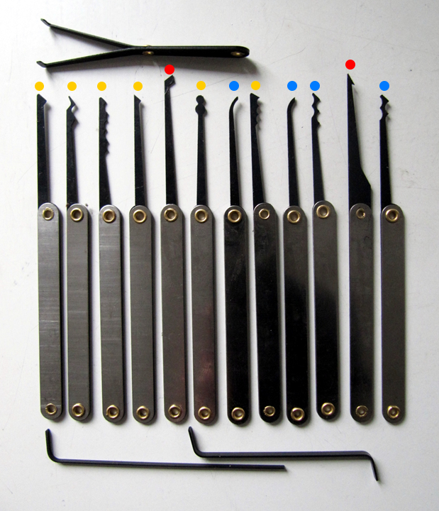

The picks labelled blue are enough to get past most locks we see today, we will be learning about them later on. The picks labelled yellow are assorted rakes and the ones labelled red  are more specialised tools (left is for a dimple lock, right is a different type of rake but can be used to pull out snapped keys).

### Locks
When we look at a lock, it is made up of different parts.

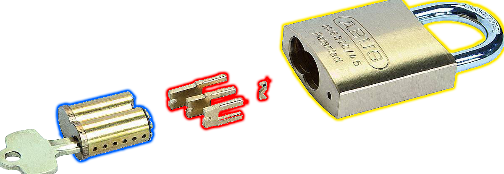
- **yellow**: the housing for the mechanism, in this case a padlock body
- **blue**: the locking mechanism the key interacts with
- **red**: individual pieces that make up the mechanism (varies between lock types)

There are an assortment of (physical) key-oriented locking mechanisms that exist. Here are some that you might see today (Wikipedia images are linked)
- [Pin and tumbler lock](https://upload.wikimedia.org/wikipedia/commons/thumb/6/6e/Pin_tumbler_with_key.svg/200px-Pin_tumbler_with_key.svg.png): Used in doors and padlocks
- [Wafer lock](https://upload.wikimedia.org/wikipedia/commons/thumb/2/28/Disc_tumbler_with_key.png/300px-Disc_tumbler_with_key.png): Used in harsh low-security areas eg. cupboard; some variations used in vehicles
- [Tubular lock](https://upload.wikimedia.org/wikipedia/commons/thumb/8/84/Tubular_locked.png/300px-Tubular_locked.png): Used in elevators, coin operated machines
- [Warded lock](https://upload.wikimedia.org/wikipedia/commons/9/9b/Warded_locked.png): Old and insecure (unlocked with skeletons keys), rarely used today
- [Disk detainer lock](https://en.wikipedia.org/wiki/Disc_tumbler_lock): Used in harsh conditions eg. bike locks, railroad locks
- [Dimple lock](http://www.lockwiki.com/index.php/Dimple): Variant of pin and tumbler lock

> Each of these have different lockpicking tools, with some overlap due to similarities in design (eg. pin-and-tumbler vs wafer).

We will be exploring the pin-and-tumbler mechanism.

#### Pin and Tumbler Locks

First, a diagram to go over some terminology and structure.

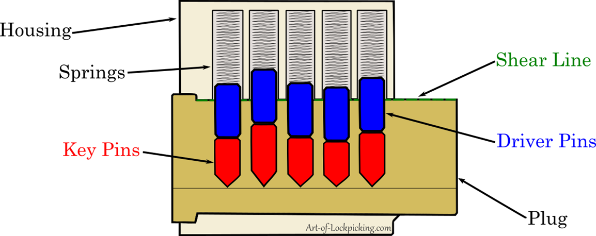

- The **pins** (key and driver) tiny cylinders that are the main actors in the locking mechanism
  - **Key pins** directly interact with the key. They are sloped to allow the key to easily slide underneath them.
    - The varying lengths of key pins determine the "unlocking pattern" of a lock
  - The springs above the pins drive/push the **Driver pins** and key pins down
    - Driver pins are often all the same length and are flat on both ends
    - They come in different varieties, called *security pins*, which make picking difficult
- The **plug** is the part of the lock that rotates when a correct key is placed inside
  - The edge on which the plug rotates is called the **Sheer line**

This animation shows what happens when the correct key is inserted into a lock.

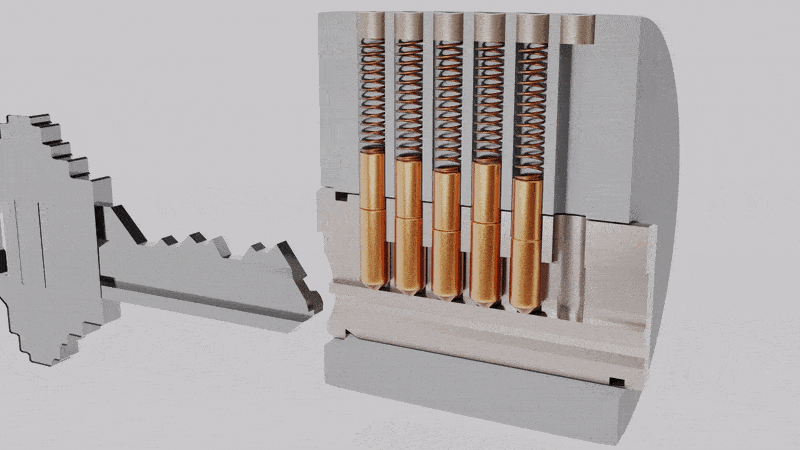

The key is cut in such a way that when inserted fully, the line between the key and driver pins match perfectly with the sheer line. Varying lengths of key pins allow for unique key patterns (called **Bitting**) and locks.
- When the correct key is inserted, the core can turn because there is nothing stuck on the sheer line
- When the incorrect key is inserted, at least one of the pins (either a key or driver pin) would be on the sheer line which blocks the core from turning

Now that we have some idea of how the lock works under normal conditions, lets look at some lock picking tools.

### Tools
The most basic (and sufficient) lock pick that we need for single pin picking is the **hook**. Here is an image of a standard Peterson's hook.

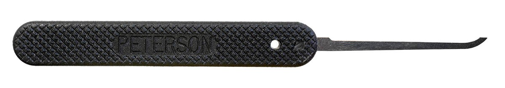

The pick is very simple, only consisting of a handle with a thin straight piece of metal that is hooked on the end. We use this to reach into locks and simply push pins up. There are many variations if the hook lockpick with the ends being higher, thinner, rounder etc. for getting around tougher locks and bittings. However for most pin-and-tumbler locks we only need a standard hook.

 

The next tool we need is something to emulate turning a key, called a **tension wrench**.

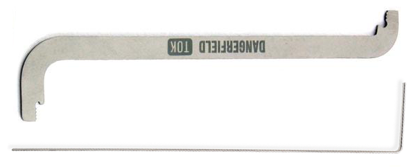

The [bottom tool](https://www.youtube.com/watch?v=NDSWx8Fngi0) is placed in the bottom of the keyway (blue below), and the [top tool](https://www.art-of-lockpicking.com/wp-content/uploads/2019/07/Tension-Wrench-Grip-SPP-Course.png) is placed in the top of the keyway (red below).

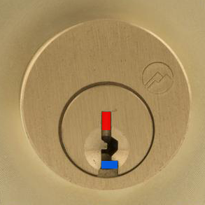

The top-of-keyway tensioner is the most popular of the two.

#### Improvised tools
You may have seen guides online about making your own lockpicking tools out of paperclips and bobby pins. Of course they may work as temporary lock picking tools, but they are never as effective as dedicated steel lock picks since we feel less feedback from most improvised tools. These makeshift tools may even cause a boat load of frustration when learning how to pick even the simplest locks.
- Paperclips: too malleable, we cannot truly apply the force we want
- Bobby pins: better than paperclips but still too bendy for picking

There are some tools that may work well, for example a bent piece of windshield wiper wire works well as a tensioner, but the process for making viable lockpicks is too much trouble for what its worth (in my opinion).

### Single pin picking

You might be wondering, **how can we push all the pins up at once using just a hook? Won't they just fall down after you push one up?** **Why do we need a tension wrench when we cant even turn the core in the first place?**

First lets watch this animation of single pin picking before we do any explaining.

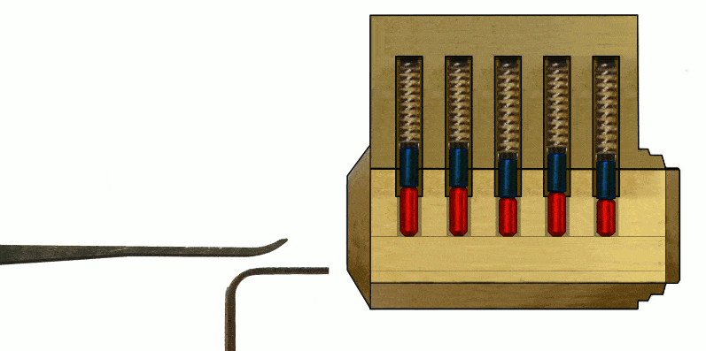

**What do we see?**
- A tension wrench is inserted in the bottom of the keyway
- A hook is inserted into the keyway and lifts up pins individually
- Some driver pins stay above the sheer line when pushed up
  - Key pins of these driver pins fall back down

**What is happening?**

We are applying moderate tension to the tension wrench in the direction that a key would turn the core. This causes *some* of the pins to start **binding** (i.e. get stuck). Why?

Ideally we want all the pin-holes in the lock to be perfectly aligned, but in reality there are machining imperfections causing them to be misaligned from the axis of rotation. (The imperfections are much more subtle than the image.)

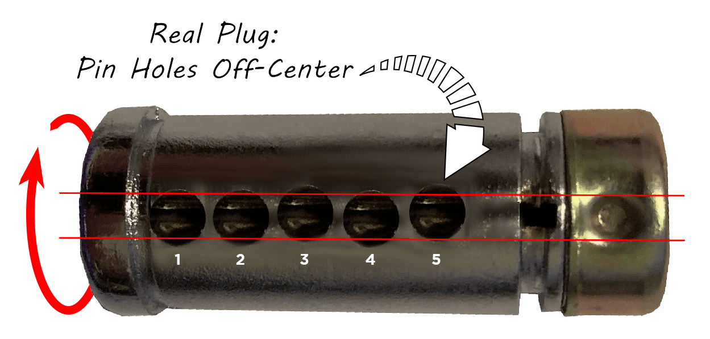

- If we rotate the core in the direction indicated by the red arrow, the pins in holes that furthest from the centre in the upwards direction will bind up. In this case one of the pins in holes labelled 3 or 5 will bind.

We can **feel for the binding pin** with our hook by gently pushing up each pin. The binding pin will feel much tougher to push up than any other pins (which will all feel springy). When we feel a binding pin, keep pushing up the pin until we feel the core turn slightly and hear a click! This means that the pin we were pushing has *just* gone over the sheer line, and the core has rotated a very miniscule amount, causing another pin to bind up (making a click sound). We say these pins are **set**.

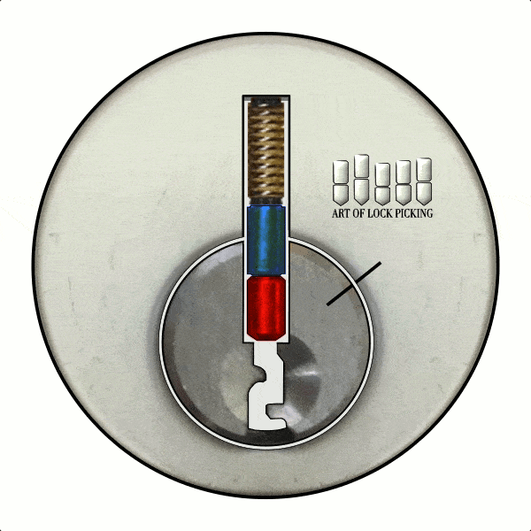

> Be careful not to push set pins any higher than the click, this causes the key pins to get stuck on the sheer line. We call these **overset**. In this case, we need to release the tension to make them drop down and try again.

> Similarly, be careful not to push a binding pin up too little, where you stop before hearing a click. This pin is not yet set but will feel like a set pin, making it difficult to find again. We call these **underset**.

When we feel for binding pins later, the set pins will feel empty instead of springy/binding.

Repeat this process of finding a binding pin and pushing it up to hear a click, until the core turns completely and we can unlock the lock!

> Demo of what it looks and sounds like (https://youtu.be/WAXj7NK0G9I)
> <iframe width="560" height="315" src="https://www.youtube.com/embed/WAXj7NK0G9I" title="YouTube video player" frameborder="0" allow="accelerometer; autoplay; clipboard-write; encrypted-media; gyroscope; picture-in-picture" allowfullscreen></iframe>

### Raking
Raking is another lock picking technique that is cool but arguably less fun. We will need a new class of tools, called **rakes**. Here is an image of a Peterson's wave rake (also called a Bogota).

There are [many other rakes that come in all sorts of shapes](https://i.pinimg.com/originals/87/a4/b2/87a4b2d5344259d9c38f289cec335f9e.png). Out of these, the wave rake is one of the most effective for pin-and-tumbler locks.

Rakes are used with an in-and-out up-and-down motion in the lock, which promotes randomness and allows the picker to set pins without having to find them. I generally use a **lighter tension** on the core compared to single pin picking because we want the "pins to move around easier" instead of "finding the binding pin".

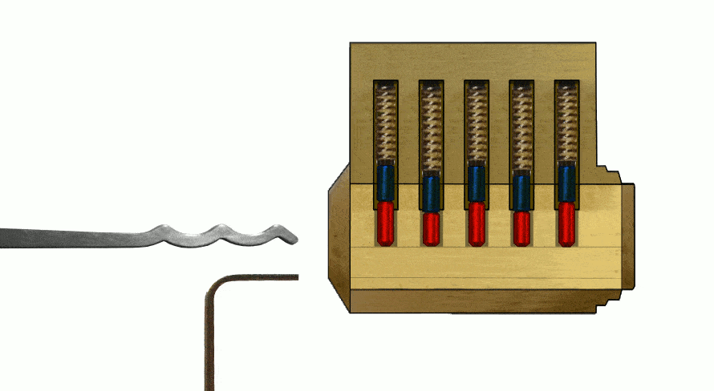

When all pins are set, you will feel the core turn.

**Why raking? Why single pin picking?**

In general, raking opens a lock up much faster than single pin picking. Single pin picking offers much more controls, and demands better understanding of the mechanism of the lock. As a beginner I believe learning single pin picking is much more rewarding (in understanding of locks) and a fun puzzle, albeit challenging.

Professionally (locksmiths, military Explosive Ordnance Disposal units etc.), where opening a lock quickly is in your best interest, rakes are one of the first tools to try on locks. Especially if it is a dangerous job, you don't want to be fumbling with single pins when your/someone's life is on the line.

## Security
Once you practice a bit, the steps to single pin picking feel rather simple and basic. We will introduce some features of higher security locks that make lockpicking life harder. Different locks may implement different security features, so a lockpicker will need to understand specifics about particular locks to be able to effectively pick them.

### Security pins
Security pins are often variant driver pins that makes single pin picking difficult, and makes raking ineffective. These feel different from regular pins (such as imitating a set pin click before being set) and require special techniques to pick. Some common ones are serrated, spool, T and mushroom pins.

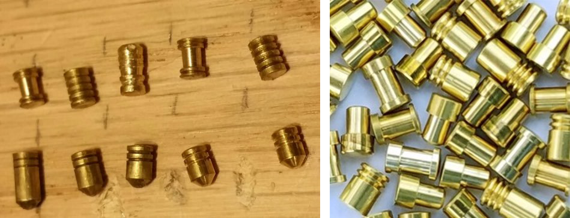

As an example lets look at **spool pins**. They have a `I` (spool) shape, and cause the core to rotate before being set, called a **false set**. In order to set these pins, we must allow the core to rotate back (**counter-rotation**) while pushing up on the pin.

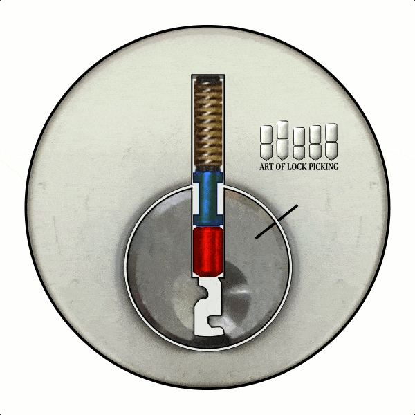

The difficulty in these pins is that rotating the core backwards can cause previously set pins to fall down (or even reset the whole lock), so we have to set them again. Working with these security pins are a delicate task and we need to learn a new set of skills, such as easing tension just enough to set spool pins.

<!-- ### False gates
For rotation based mechanisms such as disk detainer locks and combination locks, manufacturers can modify the disks so that a disk may feel set even though it isn't. These are called **false gates**.

> Look up the mechanisms for these locks if you are interested, or want to know the reason for the name. -->

### More than just pins in the lock
Locks may also include more little pieces or moving parts that prohibit the core from turning unless the right key is inserted. These could be hidden pins (usually at the back-bottom of the keyway) or a sidebar etc. Sidebars are often spring loaded bars in the cylinder which may be retracted when the certain conditions are met (these vary from lock to lock).

## Getting started
Note, I recommend avoiding cheap lockpick sets and practice locks. These are usually manufactured poorly so the picks are made from soft/brittle metal. The sets usually include a whole load of useless picks, and the clear practice lock included is so easy that it can be 'raked' open with the back of a hook! Of course if you don't mind, then go for those sets.

The picks, sets and locks linked below are a little bit more expensive, but are higher quality and very durable.

**Places to buy**
- [Pickpals (discount for this event)](https://www.pickpals.com.au/buy-lockpicks/bundles/uts-unsw-special-bundle/)
- [Pickpals](https://www.pickpals.com.au/)
- [Sparrows Canada](https://www.sparrowslockpicks.ca/)

**Minimal tools** to get started (linked is the sparrows website, but definitely look around for cheaper options)
- [a couple of standard hooks](https://www.sparrowslockpicks.ca/product_p/4.htm)
  - be gentle, these can break
- [a wave rake](https://www.sparrowslockpicks.ca/product_p/9.htm)
  - be gentle, these can break
- [a set of top-of-keyway tension bars](https://www.sparrowslockpicks.ca/product_p/ft5k.htm)
- a lock to pick (examples below)

**Lockpick Sets**
- [Sparrows Kick start](https://www.sparrowslockpicks.ca/kick_start_p/s0.htm)
  - [Expansion set](https://www.sparrowslockpicks.ca/Expansion_lock_pick_set_p/s1.htm), you don't really need this
- [Sparrows Tuxedo set](https://www.sparrowslockpicks.ca/product_p/tux1.htm), variety of rakes and picks
- [Sparrows Spirit set](https://www.sparrowslockpicks.ca/product_p/sspirit.htm), tools focused on single pin picking
- [PickPals Intro Lock Pick Set](https://www.pickpals.com.au/buy-lockpicks/sets/product-pickpals-intro-set/)
- [Southord 14 piece lockpick set](https://www.pickpals.com.au/buy-lockpicks/sets/southord-fourteen-piece-lock-pick-set/), a little more than you need

**Locks**
- Sparrows cutaway locks (you can see inside!)
  - [Standard pins](https://www.sparrowslockpicks.ca/product_p/cutawaystandard.htm)
  - [Serrated pins](https://www.sparrowslockpicks.ca/product_p/cutawayserrated.htm)
  - [Spool pins](https://www.sparrowslockpicks.ca/product_p/cutawayspool.htm)
- [Sparrows progressive lock set](https://www.sparrowslockpicks.ca/product_p/qprolok.htm)
  - [Reload kit](https://www.sparrowslockpicks.ca/product_p/qreload.htm) if you want to try your hand at changing the pins
- [Sparrows revolver](https://www.sparrowslockpicks.ca/product_p/rev.htm)
- Almost all standard size Master Locks (they are easy to pick no matter what the label tells you)
- More difficult locks (with loads of security pins, harder bitting, tighter keyways)
  - [Master Lock Red Lockout Safety Lock](https://www.bunnings.com.au/master-lock-red-kd-safety-lockout-padlock_p0055605)
  - American Lock 1100
  - Abus Titalium 80Ti/50

## Resources
There are many fantastic websites, communities and Youtube channels that help a lot with getting to know lockpicking. Examples include
- [BosbianBill (Youtube)](https://www.youtube.com/user/bosnianbill)
- [LockPickingLawyer (Youtube)](https://www.youtube.com/channel/UCm9K6rby98W8JigLoZOh6FQ)
- [LockNoob (Youtube)](https://www.youtube.com/channel/UCxZRF3OG7gapQ8kacWUwj2A)
- [Reddit, r/Lockpicking](https://www.reddit.com/r/lockpicking/wiki)
- [Art of Lockpicking](https://www.art-of-lockpicking.com/) (most of the diagrams are from their website)

# Other physical security
- Doors
  - Securing the handle/unlocking mechanism
  - Highly recommend watching this talk by Deviant Ollam about door security (https://www.youtube.com/watch?v=4YYvBLAF4T8)
- Destructive entry protection
  - Drill protection - hardened steel pins (to prevent drilling the pins)
  - Hardened steel shackles (for padlocks)
  - Shrouded (to prevent shimming padlocks)
  - Ball bearing (to prevent shimming padlocks)

