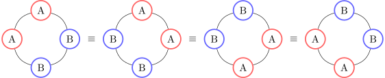
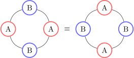

# Counting circular arrangements of objects

In high-school mathematics you've probably come across the term *combinatorics*. In its most basic form, combinatorics is about counting the number of ways you can arrange some objects in a particular fashion. For example, to arrange $n$ (distinct) objects in a line, there are $n! = n(n-1) \dots 2 \times 1$ possible permutations. If there are repeated objects, we divide by the permutations of the identical objects. For example arranging the letters of $BALLOON$ in a line, the letters $L$ and $O$ both repeat twice, so there are $\frac{7!}{2!2!}$ permutations. On the other hand, if we wanted to arrange $n$ (distinct) objects in a *circle*, each arrangement can be rotated and it is considered "identical". So we arrange the items in a line and divide by the number of different rotations of these objects (to remove the overcounted arrangements) $n!/n = (n-1)!$.

What happens when we combine these ideas together? Say we take take $n$ objects, where some are repeating, and arrange them in a circle. An easy example: arrange the letters $AABB$ in a circle. How many ways can this be done? It's easy to write down every possibility, and we find that there are only two (considering rotation as equivalent):

<!-- Image generated using tikz, converted to SVG using pdf2svg, scaled up using inkscape -->
<!-- Rescaling in inkscape: https://superuser.com/questions/475851/how-can-i-scale-an-svg-via-command-line -->

However if we try to combine the two equations we used above, the number of permutations comes out to be
$$
\frac{4!}{4 \times 2!2!} = \frac{3}{2} = 1.5.
$$
Not only is this not $2$, but isn't even a whole number! We could try many different examples and attempt formulate a nice equation, but it's not exactly that simple! It turns out there is a nice theorem that gives a general procedure to solve this, but it requires some background in group theory.

> **tl;dr**
> 
> In mathematics, Group theory is the study of symmetries, how they interact with each other, and how they interact with other objects. There is a theorem of group that counts the number of "different" elements in a set, given that elements are "not different" when are related by a symmetry (more precisely, a group action). We can apply this to concrete counting problems, by looking at e.g. rotations acting on objects arranged in a circle. This theorem can be extended to extract more information about arrangements, where the calculations are reduced to looking at coefficients of a polynomial.

## Background
The following is a quick and brief proof-less introduction to the concepts we will need. The intention is to be a refresher for those who have seen groups before, however, if you are new to these concepts, there should be barely enough to understand (with time) how the counting theorem works.

### Groups
**Definition.** A *group* is a set $G$ with a binary operation $*$, such that the following axioms hold.
- (Identity) There is an element $e \in G$ such that for any $a \in G$, $a * e = e * a = a$.
- (Associativity) For any three elements $a,b,c \in G$, $(a * b) * c = a * (b * c)$.
- (Inverse) For any element $a \in G$, there exists an element $b \in G$ for which $a * b = b * a = e$, we write $a^{-1}$ for this element.

We sometimes drop the $*$, and just write $gh = g * h$, if the operation is clear from the context.

**Example 1.** An easy example of a group is $\Z/n\Z = \{0,1,...,n-1\}$ where the operation is addition modulo $n$. This is the *cyclic group* $C_n$. We can think of this as generated by $1$, for example $\Z/4\Z = \{1,1+1,1+1+1,1+1+1+1\}$, where $1+1+1+1=0 \ (\op{mod}\ 4)$.

**Example 2.** The *symmetric group* on $n$ elements $S_n$ is a group where elements are the permutations of $1, 2, ..., n$. For two elements $a,b \in S_n$, $ab \in S_n$ is the permutation obtained by applying $b$ then applying $a$. For example the following table represents a permutation on the first $4$ integers, taking $1 \to 2 \to 3 \to 1$ and $4 \to 4$.

|        |     |     |     |     |
| ------ | --- | --- | --- | --- |
| Input  | 1   | 2   | 3   | 4   |
| Output | 2   | 3   | 1   | 4   |

A useful way to write this is with *cycle notation*. The above table corresponds to the element $(123)(4) \in S_4$, where $(123)$ and $(4)$ are *cycles*. In fact every permutation of $n$ elements can be written as a product of disjoint cycles (i.e. the numbers inside the cycles don't overlap). We often do not write cycles of length $1$ because they offer no new information. For convenience, we write the identity permutation $(1)(2)...(n)$ as $\op{id}$.

The counting theorem uses subgroups of $S_n$, which you can think of as smaller groups living inside $S_n$. The group $C_n$, from Example 1, actually appears as a subset of $S_n$, for example whose elements are powers of $(123...n)$ (generated by this cycle). From now on, this is how we will think about $C_n$.

### Group Actions
**Definition.** Let $S$ be a set and $G$ a group. A *group action* of $G$ on $S$ is an operation $g \cdot s \in S$ for $g \in G$ and $s \in S$, satisfying the following properties.
- (Identity) If $e \in G$ is the identity element, then $e \cdot s = s$ for all $s \in S$.
- (Compatibility) For $g,h \in G$, $g \cdot (h \cdot s) = (gh) \cdot s$ for all $s \in S$.

**Example.** Let $G = S_4$ and let $S$ be the set tuples representing arrangements of the letters $a,b,c,d$ in a line (without repetition). An easy group action could be for $g \in S_4$ and $s \in S$, $g \cdot s$ is permuting entries in the tuple by $g$. For example if $g = (123)(4)$ and $s = (a,b,c,d)$ then $g \cdot s = (c,a,b,d)$, because $g$ take the element in position $1$ to position $2$, the element in position $2$ to position $3$, and so on.

**Definition.** Let $G$ be a group acting on a set $S$.
- Let $s \in S$. The *orbit* of $s$ is the set of every possible element in $S$ obtained from $G$ acting on $x$, that is
  $$
  G \cdot x = \{g \cdot x: g \in G\},
  $$
  which is sometimes written $\op{Orb}(x)$. The *stabilizer* of $s$ is the set of elements of $G$ that fix $s$, that is
  $$
  \op{Stab}(x) = \{g \in G : g \cdot s = s\}.
  $$
- Let $g \in G$. The *fixed set* of $g$ is the set of every element of $S$ that is fixed by $g$, that is
  $$
  S^g = \{s \in S: g \cdot s = s\},
  $$
  which is sometimes written $\op{Fix}(x)$.

The set of orbits is typically written as $S / G = \{\op{Orb}(s): s \in S\}$.

**Example.** Let $G = C_4 \subseteq S_4$ be the group generated by one $4$-cycle (cycle length $4$) in $S_4$. Think of $C_4$ as generated by $(1234)$, whose elements are
| Element    | Cycle Decomposition |
| ---------- | ------------------- |
| $(1234)$   | $(1234)$            |
| $(1234)^2$ | $(13)(24)$          |
| $(1234)^3$ | $(1432)$            |
| $(1234)^4$ | $(1)(2)(3)(4)$      |

Let $S$ be the set $4$-tuples representing arrangements of the letters $a,b,c,d$ in a line (with repetition). Let $C_4$ act on $S$ as in the previous example. Let $s = (a,b,c,c) \in S$ then the orbit of $s$ is
$$
G \cdot s = \{(a,b,c,c), (c,a,b,c), (c,c,a,b), (b,c,c,a)\}.
$$
The stabilizer of $s$ is
$$
\op{Stab}(s) = \{\op{id}, (34)\}.
$$
Let $g = (123) \in C_4$, then the fixed set of $g$ is
$$
\begin{aligned}
S^g &= \{(a,a,a,a), (a,a,a,b), ..., (d,d,d,c), (d,d,d,d)\} \\
&= \{(x,x,x,y): x,y \in \{a,b,c,d\}\}.
\end{aligned}
$$

**Proposition.** Let $G$ be a group acting on a set $S$. The orbits of $s \in S$ partition $S$, that is
$$
\bigsqcup_{s \in S} \op{Orb}(s) = S.
$$

**Proof.** Clearly $S$ is a union of its orbits, because $s \in \op{Orb}(s)$. The disjointness follows from the invertibility of elements in $G$.

**Proposition. (Orbit-Stabilizer Theorem)** Let $G$ be a (finite) group acting on a set $S$, then for any $s \in S$
$$
|\op{Stab}(s)| = \frac{|G|}{|G \cdot s|}.
$$

**Proof.** Omitted. See [Wikipedia](https://en.wikipedia.org/wiki/Group_action#Orbits_and_stabilizers).

## Burnside's Lemma
This lemma (not actually by Burnside) tells you how many orbits of a group action there are.

**Theorem. (Burnside's Lemma)** Let $G$ be a (finite) group acting on a set $S$, then
$$
|S/G| = \frac{1}{|G|} \sum_{g \in G} |S^g|.
$$

This theorem says that the number of orbits is the *average* of the fixed sets of $S$.

**Proof.** We have that
$$
\begin{aligned}
  \sum_{g \in G} |S^g| &= \sum_{g \in G} |\{s \in S: g \cdot s = s\}| \\
  &= |\{(g,s) : g \in G, s \in S, g \cdot s = s\}| \\
  &= \sum_{s \in S} |\op{Stab}(s)| \\
  &= \sum_{s \in S} \frac{|G|}{|G \cdot s|} & \text{(Orbit-Stabilizer Thm)} \\
  &= |G| \sum_{s \in S} |G \cdot s|.
\end{aligned}
$$
Recall that $S$ can be partitioned into all orbits, so we can instead sum over orbits $A \in S/G$,
$$
\begin{aligned}
  \sum_{g \in G} |S^g|  &= |G| \sum_{s \in S} |G \cdot s| \\
  &= |G| \sum_{A \in S/G} \sum_{s \in A} \frac{1}{|G \cdot s|} \\
  &= |G| \sum_{A \in S/G} \sum_{s \in A} \frac{1}{|A|} \\
  &= |G| \sum_{A \in S/G} 1 \\
  &= |G| |S/G|,
\end{aligned}
$$
and the result follows.

---

This theorem by itself can already be used to solve our problem. Remember that we wanted to arrange the letters $AABB$ in a circle. We can take $G = C_4$ to as our group action, so that each arrangement and all its rotations can be summed up as one orbit. We wanted to know how many of these "different" arrangements (or orbits) there are, which Burnside's lemma tells us. If we let $S$ be all the tuples representing arrangements of $AABB$ in a line, then the number of orbits under $C_4$ is the number of "different" arrangements of $AABB$ in a circle.

Listing out all the arrangements of the letters of $AABB$, we get
$$
S = \{AABB, ABAB, ABBA, BABA, BAAB, BBAA\}.
$$
Since $C_4$ is generated by $(1234)$, its elements are
$$
C_4 = \{\op{id}, (1234), (13)(24), (1432)\}.
$$

For an arrangement to be fixed by a cycle, the letters at each position changed by the cycle must be the same. Then we can see that
- $S^{\op{id}} = S$,
- $S^{(1234)} = \varnothing$,
- $S^{(13)(24)} = \{ABAB, BABA\}$ (because an arrangment is fixed by $(13)(24)$ only when the letter at positions $1,3$ are equal, and the letters at positions $2,4$ are equal),
- $S^{(1432)} = \varnothing$.

So the possible number of arrangements is
$$
\begin{aligned}
  |S/C_4| &= \frac{1}{|C_4|} (|S^{\op{id}}| + |S^{(1234)}| + |S^{(13)(24)}| + |S^{(1432)}|) \\
  &= \frac{1}{4} (6 + 0 + 2 + 0) \\
  &= 2.
\end{aligned}
$$
This is exactly what we wanted! In fact Burnside's lemma is enough for any version of our problem, but we continue further to explore a theorem by Pólya that generalises this.

Before moving on, note that if we let the set $S$ be the set of all 4-element arrangements of the letters $A,B$ (with replacement), then Burnside's lemma tells us the number of ways to arrange $A,B$ on a circle (with replacement). Particularly, orbits of the arrangements of $AABB$ is a subset of the set of orbits $S/C_4$. Pólya's theorem builds on this by describing the number of circle arrangements of every 4-letter combination of $A$'s and $B$'s inside $S/C_4.$

## Pólya's Enumeration Theorem

### Preliminaries
On any permutation group (on finite elements), we can encapsulate its information in a polynomial.

**Definition.** Let $g \in S_n$ be a permutation on $n$ elements, and let $c_i(g)$ be the number of $i$-cycles in the disjoint cycle decomposition of $g$. The *cycle index* of a permutation group $G \subseteq S_n$ is the polynomial
$$
Z_G(t_1,t_2,...,t_n) = \frac{1}{|G|} \sum_{g \in G} t_1^{c_1(g)} t_2^{c_2(g)} \dots t_n^{c_n(g)}.
$$

**Example.** Let $G = C_6$ be generated by the $6$-cycle $g = (123456)$. Then we have decompositions
| Element | Cycle Decomposition  | Value of $c_i(\cdot)$ |
| ------- | -------------------- | --------------------- |
| $g$     | $(123456)$           | $c_6(g) = 1$          |
| $g^2$   | $(135)(246)$         | $c_3(g^2) = 2$        |
| $g^3$   | $(14)(25)(36)$       | $c_2(g^3) = 3$        |
| $g^4$   | $(153)(264)$         | $c_3(g^4) = 2$        |
| $g^5$   | $(165432)$           | $c_6(g^5) = 1$        |
| $g^6$   | $(1)(2)(3)(4)(5)(6)$ | $c_1(g^6) = 6$        |

where all the other values of $c_i(g^j)$ are $0$. The cycle index is
$$
Z_{C_6}(t_1,...,t_6) = \frac{1}{6} (t_6^1 + t_3^2 + t_2^3 + t_3^2 + t_6^5 + t_1^5) = \frac{1}{6} (2t_6 + 2t_3^2 + t_2^3 + t_1^5).
$$

This polynomial contains information about the types of elements in the group. For example $2t_3^2$ says there are two elements which are the product of two cycles of length $3$: $g^2 = (135)(246)$ and $g^4 = (153)(264)$. (The number of cycles in the decomposition isn't unrelated to the fact that $\gcd(6,2) = 2 = \gcd(6,4)$ but is not too important.)

**Definition.** Let $C$ and $D$ be sets, then $C^D$ is the set of functions $f: D \to C$.

**Proposition.** If $G$ were a (finite) group acting on $D$, then there is a $G$-action on $C^D$ defined by
$$
(g \cdot f)(d) = f(g^{-1} \cdot d)
$$
for any $f \in C^D$ and $d \in D$. We use the convention of naming the sets $C$ and $D$ because they correspond to *colouring* and *domain*. So each function $f \in C^D$ can be thought of assigning to each element of $D$ a colour in $C$.

The main feature of Pólya's theorem is that it distinguishes between 'weights' of particular combinations of colours.

**Definition.** Let $w: C \to \R$ be a function that assigns to each colour $c \in C$ a weight $w(c) \in \R$. For $f \in C^D$, define the weight of $f$
$$
W(f) = \prod_{d \in D}  w(f(d)).
$$

**Proposition.** Let $f_1,f_2 \in C^D$ be in the same $G$-orbit, then $W(f_1) = W(f_2)$.

**Proof.** By definition there exists some $g \in G$ such that $f_1(x) = (g \cdot f_2)(x) = f_2(g^{-1} \cdot x)$. Then
$$
W(f_1) = \prod_{d \in D}  w(f_1(d)) = \prod_{d \in D}  w(f_2(g^{-1} \cdot d)) = \prod_{d \in D}  w(f_2(d)) = W(f_2).
$$
where the third equality follows from the invertibility of elements in $G$. Then $G$-actions are permutations on $D$, so summing over every element of $D$ is the same as summing over every element of $g^{-1} \cdot D = \{g^{-1} \cdot d: d \in D\}$.

---

Due to this property, we can assign a weight to entire orbits $F \in C^D/G$, where $W(F) = W(f)$ for any $f \in F$.

**Example.** Consider the example of arranging $6$ objects in a circle, where each object can be one of two letters $A$ or $B$. (This will also motivate how we will use the weights for the problem of arranging elements in a circle.) Let $D = \{1,2,3,4,5,6\}$ be the positions on the circle and $C = \{A,B\}$ be the letters they could be assigned, and let $C_6$ act on $C^D$ as above. Define $w$ so that $w(A) = a$ and $w(B) = b$, where $a,b$ are numbers in $\R$. Consider the function $f_1$ mapping $1,2,3 \mapsto A$ and $4,5,6 \mapsto B$, and $f_2$ mapping $1,3,5 \mapsto A$ and $2,4,6 \mapsto B$.
We have
$$
W(f_1) = w(f_1(1)) w(f_1(2)) w(f_1(3)) w(f_1(4)) w(f_1(5)) w(f_1(6)) = aaabbb = a^3b^3
$$
and
$$
W(f_2) = ababab = a^3b^3.
$$

Notice that, even though they have the same weight, these functions don't belong to the same orbit, since $AAABBB$ and $ABABAB$ are not rotations of each other. So these weights lose information about the functions, but tells us how many times each letter appears, but nothing about their order. This is perfect for what we want!

<!-- It might seem strange that we use indeterminants for the weights. If we wanted something more concrete we can set $a,b$ be different primes [how can we extract out the coefficients?] -->

### Theorem
In general context, we think of $C$ as "colours", and $f \in C^D$ as colour assignments to elements in $D$, or "colourings of $D$". The problem we care about is: *How many of colourings have a certain weight?*

**Theorem. (Pólya's Enumeration Theorem)** Let $C,D$ be finite sets, $G$ a finite group acting on $D$, and $w: C \in \R$ be a weight function. Then the *pattern inventory* is
$$
\sum_{F \in C^D/G} W(F) = Z_G\left(\sum_{c \in C} w(c), \sum_{c \in C} w(c)^2, ...\right).
$$
The sum $\sum_{F \in C^D/G} W(F)$ is sometimes called the (multivariate) *generating function* for the different colourings of $D$ (the coefficient of each monomial, as a polynomial in the elements of $C$, is the number of colourings corresponding to the monomial). Note that we can use any group action.

**Proof.**
Starting with $\sum_F W(F)$, consider the possible weights
$$
\Omega = \{\omega: W(f) = \omega \text{ for some } f \in C^D\}.
$$
Recall that the $G$-action on $D$ induces a $G$-action on $C^D$, so we can reindex the sum in terms of $\Omega$ to get
$$
\sum_{F \in C^D/G} W(F) = \sum_{\omega \in \Omega} \omega |S_\omega/G|,
$$
where $S_\omega = \{f: D \to C | W(f) = \omega$, so $S_\omega/G = \{F \in C^D/G: W(F) = \omega\}$ is the set of orbits which have weight $\omega$. (Note this uses the induced $G$-action on $C^D$, which is well defined because $G$ maps orbits to themselves, and function weights are preserved within the orbits.) Using Burnside's Lemma,
$$
\sum_{F \in C^D/G} W(F) = \sum_{\omega \in \Omega} \omega \left(\frac{1}{|G|} \sum_{g \in G} |S_\omega^g| \right) = \frac{1}{|G|} \sum_{g \in G} \sum_{\omega \in \Omega} \omega |S_\omega^g|
$$
where $S_\omega^g$ is the subset of $S_\omega$ fixed by $g$, and we can switch the sums because they are finite.

It remains to prove that for fixed $g \in G$,
$$
\sum_{\omega \in \Omega} \omega |S_\omega^g| = \left(\sum_{c \in C} w(c)\right)^{c_1(g)} \left(\sum_{c \in C} w(c)^2\right)^{c_2(g)} \dots.
$$

Write $g$ as a product of disjoint cycles. If we think of the terms in the expansion of the right hand side as a series of choices: $c_1(g)$ choices of $c \in C$ for factors of $w(c)$, $c_2(g)$ choices of $c \in C$ for factors $w(c)^2$ etc. Then each term is some product of $|D|$ weights such that the corresponding colour combination is fixed by $g$, and its coefficient is how many ways this can be chosen. (This thought process is similar to counting monomials in an expanded binomial to obtain the binomial coefficients.) We can check that these choices are the only ways to get a colouring $f$ fixed by $g$. Notice that for such a colouring $f \in (C^D)^g$, its weight $W(f)$ is defined exactly as its corresponding monomial above. Therefore the right hand product is exactly
$$
\sum_{f \in (C^D)^g} W(f) = \sum_{\omega \in \Omega} \sum_{f \in S_\omega^g} W(f) = \sum_{\omega \in \Omega} \sum_{f \in S_\omega^g} \omega = \sum_{\omega \in \Omega} \omega |S_\omega^g|.
$$

This concludes the proof.

---

**Corollary.** If we choose all the weights to be $1$, the number of $G$-orbits of $C^D$ is $Z_G(|C|,...,|C|)$.

**Proof.** For any orbit $F \in C^D/G$, $W(F) = 1$ because it is a product of weights, which are all $1$. Then 
$$
\sum_{F \in C^D/G} W(F) = \sum_{F \in C^D/G} 1 = |C^D/G|.
$$
By Pólya's Enumeration Theorem,
$$
\begin{aligned}
  |C^D/G| &= \sum_{F \in C^D/G} W(F) \\
  &= Z_G\left(\sum_{c \in C} w(c), \sum_{c \in C} w(c)^2, ...\right) \\
  &= Z_G\left(\sum_{c \in C} 1, \sum_{c \in C} 1, ...\right) \\
  &= Z_G(|C|,...,|C|).
\end{aligned}
$$

This retrieves Burnside's lemma. (This is exactly Burnside's lemma if $|D| = 1$.)

### Intuition
Following the proof gives us some intuition into how the right hand polynomial can be interpreted. Let us consider the example of colouring $D$ with colours in $C$, and suppose the weights are indeterminates $C_1, ..., C_n$ which uniquely correspond to each colour $c_1, ..., c_n$ respectively.

It is easy to understand the left hand side: each $G$-orbit of $C^D$ corresponds to a particular colouring we want to think of as "identical" when acted on by elements of $G$. Given an orbit $F \in C^D/G$, $W(F)$ is a product of weights $w(c)$ for some $c \in C$. So in the sum of $W(F)$ over all orbits $F$, the coefficient of a monomial $C_1^{d_1} \dots C_n^{d_n}$ (where $d_1 + \dots + d_n = |D|$) will be the number of different ways $|D|$ can be coloured with $d_1$ of $c_1$, $d_2$ of $c_2$ etc. This tells us the looking at the coefficients of this polynomial gives us the "counting" information we want.

In the proof, we took this left polynomial and grouped it into orbits of the same weight. Doing this, we found that the coefficient of each possible function weight $\omega$ is the number of $G$-orbits of $S_\omega$ (functions in $S$ with weight $\omega$). Burnside's lemma tells us that this number is just the average size of fixed sets of $S_\omega$, so the task of finding the coefficient of $\omega$ is reduced to finding the size of fixed sets of $S_\omega$.

This information is captured by the coefficients of the product,
$$
\left(\sum_{c \in C} w(c)\right)^{c_1(g)} \left(\sum_{c \in C} w(c)^2\right)^{c_2(g)} \dots
$$
where each term is a series of choices to colour parts of $D$ fixed by a cycle in $g$, altogether the choices correspond to one colouring fixed by $g$. Collecting the terms of equal weight, we obtain the number of colourings of that weight that is fixed by $g$. 

Note: we also see that Pólya's theorem is essentially just Burnside's lemma applied to each weight.

### Example 1
Let's return to our original problem, this time with a slightly harder example: *How many different circular arrangements of the letters of $XXYYZZ$ are there?*

In Pólya's Enumeration Theorem, let $D = \{1,2,3,4,5,6\}$, $C = \{X,Y,Z\}$, and $w$ assign weights $X \mapsto x, Y \mapsto y$ and $Z \mapsto z$. Let $G = C_6$ be generated by $(123456)$ (we listed its elements in a previous example), and act on $D$ by permuting the elements, then $G$ also acts on $C^D$ as described earlier. To get intuition on what this action looks like, consider $g = (123456) \in C_6$ and $f \in C^D$ mapping $1,2,3,4,5,6$ to $X,X,Y,Z,Y,Z$ respectively. Then
|                                                 |
| ----------------------------------------------- |
| $(g \cdot f)(1) = f(g^{-1} \cdot 1) = f(6) = Z$ |
| $(g \cdot f)(2) = f(g^{-1} \cdot 1) = f(1) = X$ |
| $(g \cdot f)(3) = f(g^{-1} \cdot 1) = f(2) = X$ |
| $(g \cdot f)(4) = f(g^{-1} \cdot 1) = f(3) = Y$ |
| $(g \cdot f)(5) = f(g^{-1} \cdot 1) = f(4) = Z$ |
| $(g \cdot f)(6) = f(g^{-1} \cdot 1) = f(5) = Y$ |

so $g \cdot f$ maps $1,2,3,4,5,6$ to $Z,X,X,Y,Z,Y$. Here $(123456)$ permuted the image of $f$ like it permutes the elements of $D$: rotating $X,X,Y,Z,Y,Z \to Z,X,X,Y,Z,Y$. This is just how we expect $C_6$ to act on colourings, and is actually true in general. The theorem says we can calculate the right hand polynomial and look at the coefficients. In our case, the polynomial is
$$
\begin{aligned}
&Z_{C_6}\left(\sum_{c \in C} w(c), \sum_{c \in C} w(c)^2, ...\right) \\
&= Z_{C_6}(x + y + z, x^2 + y^2 + z^2, ...) \\
&= \frac{1}{|C_6|} \sum_{g \in C_6} (x + y + z)^{c_1(g)} (x^2 + y^2 + z^2)^{c_2(g)} ... (x^6 + y^6 + z^6)^{c_6(g)} \\
&= \frac{1}{6} ((x^6 + y^6 + z^6)^1 + (x^3 + y^3 + z^3)^2 + (x^2 + y^2 + z^2)^3 \\
  &\hspace{20px} + (x^3 + y^3 + z^3)^2 + (x^6 + y^6 + z^6)^1 + (x + y + z)^6 ) \\
&= \frac{1}{6} (2(x^6 + y^6 + z^6) + 2(x^3 + y^3 + z^3)^2 + (x^2 + y^2 + z^2)^3 + (x + y + z)^6)
\end{aligned}
$$
(using the values for $C_6$ generated by $(123456)$ we calculated in a previous example). We could endure the suffering of expanding this out, or just look at the coefficients of the terms we want. The following is a useful generalisation of the binomial theorem.

**Theorem. (Multinomial Theorem)** The coefficient of $x_1^{k_1} \dots x_m^{k_m}$ (where $k_1 + \dots +  k_m = n$) in the expansion of $(x_1 + \dots + x_m)^n$ is
$$
\binom{n}{k_1, \dots, k_m} = \frac{n!}{k_1! \dots k_m!}.
$$

**Proof.** Similar to that of binomial theorem.

For our purposes, we consider the coefficient of $x^2 y^2 z^2$.
- It does not appear in $(x^6 + y^6 + z^6)$ and $(x^3 + y^3 + z^3)^2$
- This term appears in $(x^2 + y^2 + z^2)^3$ as $(x^2)^1 (y^2)^1 (z^2)^1$ which has coefficient $\binom{3}{1,1,1} = 3! = 6$.
- It also appears in $(x + y + z)^6$ as $x^2 y^2 z^2$ which has coefficients $\binom{6}{2,2,2} = \frac{6!}{2!2!2!} = 90$

Therefore the coefficient of $x^2 y^2 z^2$ in the pattern inventory is
$$
\frac{1}{6}(6 + 90) = 16.
$$

We can check this is correct via a [simple script](https://github.com/dustbringer/dustbringer.github.io/blob/main/src/post_resources/2022-12-03-polya-enumeration/permutations-lister.py).

**Remarks.** You may have noticed that multinomial coefficients are exactly how we were taught to count the permutations of letters with possibly some repeating. So it makes sense that it comes up when counting arrangements of the same letters in a circle.

### Example 2
Here is another example illustrating an easier case. Let $D = \{1,2,3,4,5,6,7\}$, $C = \{X,Y,Z\}$, and $w$ assign weights $X \mapsto x, Y \mapsto y$ and $Z \mapsto z$. Let $G = C_7$ be generated by $g = (1234567)$ so the elements are
| Element | Cycle Decomposition     | Value of $c_i(\cdot)$ |
| ------- | ----------------------- | --------------------- |
| $g$     | $(1234567)$             | $c_7(g) = 1$          |
| $g^2$   | $(1357246)$             | $c_7(g^2) = 1$        |
| $g^3$   | $(1473625)$             | $c_7(g^3) = 1$        |
| $g^4$   | $(1526374)$             | $c_7(g^4) = 1$        |
| $g^5$   | $(1642753)$             | $c_7(g^5) = 1$        |
| $g^6$   | $(1765432)$             | $c_7(g^6) = 1$        |
| $g^7$   | $(1)(2)(3)(4)(5)(6)(7)$ | $c_1(g^7) = 7$        |

where all the other values of $c_i(g^j)$ are $0$. As before, this group acts on $D$ by permuting the elements and also acts on $C^D$. Then the pattern inventory is
$$
Z_{C_7} (x+y+z,..., x^7 + y^7 + z^7) = \frac{1}{7}(6(x^7 + y^7 + z^7) + (x + y + z)^7).
$$

This tells us that there is $\frac{1}{7}(6 + 1) = 1$ circular arrangement for each of $X^7, Y^7, Z^7$, and for other powers there are
$$
\frac{1}{7} \binom{7}{k_1,k_2,k_3} = \frac{1}{7} \frac{7!}{k_1! k_2! k_3!} = \frac{6!}{k_1! k_2! k_3!}
$$
circular arrangements for $X^{k_1} Y^{k_2} Z^{k_3}$ (where $k_1 + k_2 + k_3 = 7$).

Notice that we have this kind of polynomial because all the non-identity cycle decompositions are $7$-cycles. In fact this happens exactly when the number of elements is prime.

**Proposition.** Let $p$ be prime. Then for $D$ where $|D| = p$, $C = \{A_1,...,A_n\}$, $G = C_p$, the pattern inventory is
$$
\frac{1}{|G|} \left((p-1)\sum_{c \in C} w(c)^p + \left(\sum_{c \in C} w(c)\right)^p\right).
$$
That is, there are
$$
\frac{1}{p}\binom{p}{k_1, ..., k_n} = \frac{(p-1)!}{k_1! ... k_n!}
$$
circular arrangements for $c_1^{k_1} ...c_n^{k_n}$, where $k_1 + ... + k_n = p$ and $0 \leq k_1, ..., k_n < p$.

This shows that the naïve formula we started with works for non-trivial colourings of a prime number of elements.

### Formula
Is there a nice general formula we can extract from this theorem? Not really, but we can pull something together.

Briefly, what we need to know is the following. (The first three points find the pattern inventory, and the last point find the desired coefficient.)
- How large is $C_m$? It has $m$ elements
- How do elements of $C_m$ decompose into disjoint cycles? How large are these cycles and how many cycles are there?
  - If $C_m$ is generated by $g=(12...m)$, then letting $d = \gcd(m,k)$ we get that $g^k$ is a product of $d$ disjoint $m/d$-cycles.
- How many elements have same cycle size and cycle lengths?
  - In the context of the previous point, there are $N_d = \#\{k : 1 \leq k \leq m \text{ s.t. } \gcd(m,k) = d\}$ cycles 'similar' to $g^k$. This tells us how many times $(c_1^{m/d} + c_2^{m/d} + ...)^d$ appears in the pattern inventory.
  - There is no 'nice' equation for this number (it could be expressed in terms of the [Möbius function](https://en.wikipedia.org/wiki/M%C3%B6bius_function)).
- Which of these multinomials has our pattern $x_1^{k_1} x_2^{k_2} ...$?
  - This can be done by checking $\sum_i k_i = m$ and $m/d \mathrel{|} k_i$ for all $i$, for each multinomial $(c_1^{m/d} + c_2^{m/d} + ...)^d$.

So given a valid list of 'colours' $x_1^{k_1} x_2^{k_2} ...$, the coefficient in the pattern inventory (i.e. the number of arrangements of these colours) looks something like
$$
\frac{1}{m} \sum_{\substack{d | m \\ (m/d) | k_i, \forall i}} N_d \binom{d}{\frac{k_1}{m/d}, \frac{k_2}{m/d}, ...}.
$$

## Additional Comments and Material
We only looked at cyclic groups $C_n$, but we could use any subgroup of $S_n$. For example if we think of reflections of our circular arrangements as "identical", then we can use the dihedral group $D_n$. The orbits under the dihedral group is exactly the distinct "circular arrangements" we want.

The theorem can also be applied for various different counting problems, by changing the weights and subgroup of $S_n$. For example, Pólya applied this theorem to count the number of isomers of hydrocarbons, which popularised its usage.

This post was based on the following. These are good reading if you want to explore this topic more.
- [Discrete Methods Lecture 1, Frédérique Oggier](https://feog.github.io/chap1dm.pdf)
- [Pólya's Enumeration, Alec Zhang](http://math.uchicago.edu/~may/REU2017/REUPapers/Zhang,Alec.pdf)
- [Necklace (Combinatorics), Wikipedia](https://en.wikipedia.org/wiki/Necklace_(combinatorics))
- [(Polya Enumeration Theorem) MIT PRIMES Project, Sebastian Zhu, Vincent Fan](https://math.mit.edu/research/highschool/primes/materials/2018/conf/17-3%20Fan-ZhuS.pdf)
